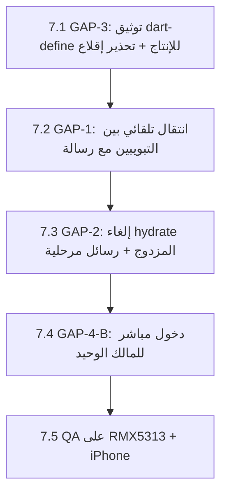

# خطة سياسة المصادقة البسيطة — v1
## Naboo ERP — تسجيل الدخول وإنشاء الحساب فقط، بدون تعقيد

**التاريخ:** 6 يوليو 2026  
**الجمهور:** صاحب المنتج + المبرمج المنفّذ  
**المراجع المقروءة قبل هذا التقرير:**
- `docs/auth/GOOGLE_SIGNIN_PLATFORM_REFERENCE.md` (كيف يعمل Google اليوم)
- `docs/auth/google_auth_implementation.md` (بنية Google + PIN + الفجوات F1–F4)
- `docs/auth/SENSITIVE_ISSUES_AUDIT_REPORT.md` + `REMEDIATION_WORK_PLAN.md` (المراحل 0–6 المنفَّذة)
- `docs/auth/PIN_INPUT_UX_AUDIT_REPORT.md` (توحيد PIN 4 أرقام — منفَّذ)
- الكود: `auth_provider.dart`، `login_screen.dart`، `google_auth_result.dart`، `google_oauth_config.dart`

---

## 1. السياسة المطلوبة (كما وصفها صاحب المنتج)

### شاشة تسجيل الدخول — طريقتان فقط
1. **بريد + رمز الدخول** (الحقول المكتوبة).
2. **زر Google** → تظهر **نافذة حسابات الجهاز** (iOS / Android) → يختار حسابه → **يدخل مباشرة** بدون انتظار طويل وبدون خطوات إضافية.

### شاشة إنشاء الحساب — طريقتان فقط
1. **إملاء المعلومات يدوياً** → الحساب **مرتبط بالبريد** → **تُرسل رسالة تحقق** إلى بريده قبل تفعيل الحساب.
2. **زر Google** → نافذة حسابات الجهاز → يختار حساباً:
   - **إذا كان لديه حساب سابق** بنفس البريد → رسالة واضحة: **«لديك حساب — انتقل إلى تسجيل الدخول»** (كما في التطبيقات العالمية).
   - **إذا لم يكن لديه حساب** → يتابع **مباشرة** باقي خطوات إنشاء الحساب.

> هذان المساران فقط. لا OTP دخول لجهاز جديد (أُزيل في المرحلة 0)، لا مسارات جانبية إضافية.

---

## 2. الخلاصة التنفيذية — أين نقف اليوم؟

**الخبر الجيد:** حوالي **85% من هذه السياسة منفَّذ فعلاً** في الكود بعد المراحل 0–6. البنية التحتية (intent، منتقي الحسابات الأصلي، فحص وجود الحساب، OTP البريد للتسجيل اليدوي) **موجودة وتعمل**.

**الفجوات الفعلية 4 فقط:**

| # | الفجوة | الحجم |
|---|--------|-------|
| GAP-1 | رسالة «لديك حساب» تظهر SnackBar فقط — **لا تنقل** المستخدم لتبويب الدخول تلقائياً | صغير (UI) |
| GAP-2 | الدخول بعد Google **ليس فورياً بصرياً** — hydrate حتى 35 ثانية بشاشة انتظار عامة | متوسط (UX + توقيتات) |
| GAP-3 | `GOOGLE_WEB_CLIENT_ID` مضبوط في `.vscode` فقط — إن غاب من build الإنتاج يسقط للمتصفح الخارجي (تجربة سيئة) | صغير (build config) |
| GAP-4 | المالك بعد Google login قد يمرّ بـ `/employee-gate` بدل الرئيسية — قرار منتج مطلوب | قرار + صغير |

---

## 3. المطابقة التفصيلية — المطلوب مقابل الموجود

### 3.1 تسجيل الدخول

| المطلوب | الحالة في الكود | الملف |
|---------|-----------------|-------|
| بريد + رمز دخول | ✅ منفَّذ — `login()` مع fallback سحابي للجهاز الثاني | `auth_provider.dart:846` |
| زر Google في تبويب الدخول | ✅ منفَّذ — `handleGoogleAuth(intent: login)` | `login_screen.dart` ~390 |
| **نافذة حسابات الجهاز** (لا متصفح) | ✅ منفَّذ عبر `google_sign_in` + `signInWithIdToken` — **بشرط** `GOOGLE_WEB_CLIENT_ID` | `native_google_id_token_sign_in_io.dart` |
| login + حساب غير موجود → رسالة «أنشئ حساباً» | ✅ منفَّذ — `kGoogleNoAccountFound` | `auth_provider.dart` + `login_screen.dart:422` |
| **دخول مباشر** بعد اختيار الحساب | ⚠️ **جزئي** — يدخل لكن بعد hydrate (حتى 35s) وقد يمر بوابة الموظفين | GAP-2 + GAP-4 |

### 3.2 إنشاء الحساب

| المطلوب | الحالة في الكود | الملف |
|---------|-----------------|-------|
| إملاء معلومات يدوياً | ✅ منفَّذ — اسم + بريد + جوال + PIN | `login_screen.dart` (تبويب التسجيل) |
| **رسالة تحقق للبريد** عند التسجيل اليدوي | ✅ منفَّذ — OTP إلى البريد عبر `EmailOtpScreen`؛ الحساب لا يكتمل قبل التحقق | `email_otp_screen.dart` + `finalizeOwnerPin` |
| زر Google في تبويب التسجيل | ✅ منفَّذ — `handleGoogleAuth(intent: signup)` | نفس المسار |
| نافذة حسابات الجهاز | ✅ نفس مسار الدخول | — |
| **signup + حساب موجود → «لديك حساب، سجّل الدخول»** | ✅ الفحص والرسالة منفَّذان (`kGoogleAccountAlreadyExists`) — ⚠️ لكن SnackBar فقط، لا انتقال تلقائي للتبويب | GAP-1 |
| signup + حساب جديد → متابعة خطوات التسجيل مباشرة | ✅ منفَّذ — `needsProfileCompletion` → شاشة «إكمال الحساب» (جوال + PIN) | `complete_owner_profile_screen.dart` |

**تعريف «الحساب موجود»** (مهم): وجود سرّ PIN للمالك في `owner_auth_secrets` على Supabase — ليس مجرد صف `auth.users` (لأن OAuth يُنشئ auth.users لحظة اختيار الحساب دائماً). هذا التعريف **صحيح ويبقى**.

**ملاحظة مصطلح:** «الباسورد» في هذا التطبيق = **رمز PIN (4 أرقام)** — سياسة موحّدة نُفّذت في المرحلة 6. لا يوجد نظام كلمة سر منفصل، ولا نضيف واحداً.

---

## 4. الفجوات — التشخيص الدقيق

### GAP-1 — «لديك حساب» بدون انتقال تلقائي (P1، ~30 دقيقة)

**اليوم** (`login_screen.dart:430`):

```dart
accountAlreadyExists: () {
  setState(() => _isLoading = false);
  _showWarningSnackBar('لديك حساب مسجل مسبقاً... يرجى تسجيل الدخول من الأسفل');
},
```

المستخدم يقرأ الرسالة ثم عليه **بنفسه** الضغط على «العودة إلى تسجيل الدخول». التطبيقات العالمية تنقله فوراً.

**المطلوب:**
- `accountAlreadyExists` → `setState(_isSignUpMode = false)` + SnackBar أخضر «لديك حساب — سجّل الدخول بنفس حساب Google» + تركيز على زر Google.
- المقابل: `noAccountFound` في تبويب الدخول → الانتقال التلقائي لتبويب **إنشاء حساب** + رسالة مماثلة.

### GAP-2 — الدخول ليس «مباشراً» بصرياً (P1، ~2–3 ساعات)

**السبب في الكود:** بعد اختيار الحساب، `_finalizeGoogleOAuthSession` يمر بـ:
1. RPC فحص الهوية
2. `_resolveTenantCloudStatus`
3. `hydrateCloudAccountData(timeout: 20s)` داخل finalize
4. ثم `resolveRouteAfterAuthenticatedSession` → `hydrateCloudAccountData(timeout: 35s)` **مرة ثانية**

```765:768:lib/providers/auth_provider.dart
      await hydrateCloudAccountData(
        timeout: const Duration(seconds: 35),
        forcePull: true,
        forceImportOnPull: true,
```

المستخدم يرى «جاري تسجيل الدخول بـ Google…» ثم «جاري تهيئة مساحة العمل…» — قد تصل التجربة لعشرات الثواني على شبكة بطيئة.

**المطلوب (بدون كسر الهيكل):**
1. **إلغاء hydrate المزدوج:** `resolveRouteAfterAuthenticatedSession` يتخطى hydrate إذا نفّذه finalize للتو (علامة `_hydratedRecently` أو تمرير parameter). الآلية موجودة جزئياً (`_hydrateInFlight`) — تحتاج توسيعاً ليشمل «اكتمل قبل ثوانٍ».
2. **خفض timeout** الثاني من 35s إلى 15s (المسار الأول غطّى السحب).
3. **رسائل مرحلية** في overlay: «جاري التحقق من حسابك…» → «جاري استعادة بياناتك…» بدل نص واحد جامد، ليشعر المستخدم بالتقدم.

**ما لا نغيّره:** ترتيب الخطوات الأمنية (RPC → tenant → bind → upsert) يبقى كما هو.

### GAP-3 — Client ID في `.vscode` فقط (P0 للإطلاق، ~30 دقيقة)

`GOOGLE_WEB_CLIENT_ID` موجود في `.vscode/settings.json` — يعمل عند التشغيل من IDE فقط. أي بناء إنتاج (`flutter build apk/ipa`) **بدونه** يسقط لمسار المتصفح الخارجي + deep link — عكس التجربة المطلوبة تماماً.

**المطلوب:**
- توثيق أمر البناء الرسمي في `docs/store/` (checklist الإصدار):
  ```bash
  flutter build apk --release \
    --dart-define=SUPABASE_URL=... \
    --dart-define=SUPABASE_ANON_KEY=... \
    --dart-define=GOOGLE_WEB_CLIENT_ID=281392172783-....apps.googleusercontent.com
  ```
- (اختياري) ملف `dart_defines.json` + `--dart-define-from-file` لتوحيد البيئات.
- (اختياري تحصين) في `main.dart`: تحذير `AppLogger.warn` عند الإقلاع إذا كان release و`GOOGLE_WEB_CLIENT_ID` فارغاً.

### GAP-4 — المالك بعد Google → بوابة الموظفين (قرار منتج)

`resolveRouteAfterAuthenticatedSession` يعيد `/employee-gate` للمالك إذا كان الجهاز مربوطاً — **سلوك ERP مقصود** (اختيار من سيعمل على الجهاز)، لكنه يخالف توقع «يدخل مباشرة».

**الخياران:**

| الخيار | السلوك | التقييم |
|--------|--------|---------|
| **A — إبقاء البوابة** (الوضع الحالي) | Google → بوابة «من سيبدأ العمل؟» → PIN → الرئيسية | أصحّ لمتجر متعدد الموظفين؛ خطوة إضافية للمالك الفردي |
| **B — دخول مباشر إذا المالك هو المستخدم الوحيد** | إن كان في الجهاز مستخدم واحد فقط (المالك) → `/home` مباشرة؛ وإلا → البوابة | **موصى به** — يحقق «الدخول المباشر» دون كسر سيناريو الموظفين |

**التوصية:** الخيار B — شرط بسيط في `resolveRouteAfterAuthenticatedSession`: إذا `listActiveUsersForEmployeeGate().length == 1` والوحيد هو المالك المرتبط بجلسة Google الحالية → `/home`.

---

## 5. خطة التنفيذ — المرحلة 7 (سياسة الدخول البسيطة)



| # | البند | الملفات | الجهد | مخاطرة |
|---|-------|---------|-------|--------|
| 7.1 | build config + تحذير إقلاع | `docs/store/v1.0_release_checklist.md`، `main.dart` | 30m | لا شيء |
| 7.2 | التبديل التلقائي للتبويب الصحيح | `login_screen.dart` فقط (`accountAlreadyExists` / `noAccountFound`) | 30m | منخفضة جداً |
| 7.3 | hydrate مرة واحدة + overlay مرحلي | `auth_provider.dart` (`resolveRouteAfterAuthenticatedSession`)، `login_screen.dart` (`_withAuthOverlay`) | 2–3h | متوسطة — يلمس التوجيه؛ تغطّيه اختبارات auth |
| 7.4 | مالك وحيد → `/home` مباشرة | `auth_provider.dart` (شرط واحد) | 1h | منخفضة — لا يغيّر مسار تعدد المستخدمين |
| 7.5 | QA يدوي | — | 1–2h | — |

**الترتيب مقصود:** 7.1 و7.2 آمنان تماماً ويمكن شحنهما فوراً؛ 7.3 و7.4 يلمسان التوجيه فيُختبران معاً.

### ما **لا** يُنفَّذ في هذه المرحلة (لتجنب التعقيد الذي رفضتَه)
- لا Apple Sign-In (مؤجل حتى متطلبات App Store).
- لا تغيير في تعريف «الحساب المكتمل» (`owner_auth_secrets`).
- لا تغيير في مسار OTP التسجيل اليدوي — يعمل ويطابق طلبك (رسالة للبريد قبل التفعيل).
- لا مزامنة PIN المالك بين الأجهزة (F1) — قرار أمني قائم؛ الجهاز الجديد يمر بـ OTP استعادة، وهذا خارج نطاق «الدخول البسيط».
- لا فرع Desktop/متصفح منفصل — أولوية الموبايل.

---

## 6. التدفقان النهائيان بعد المرحلة 7 (كما سيراهما المستخدم)

### تسجيل الدخول
```
بريد + PIN → دخول
        أو
زر Google → نافذة حسابات الجهاز → اختيار
    ├─ حساب موجود → «جاري استعادة بياناتك…» (مرة واحدة) → الرئيسية*
    └─ لا حساب → انتقال تلقائي لتبويب إنشاء حساب + رسالة
```
\* مالك وحيد → الرئيسية مباشرة؛ عدة مستخدمين → بوابة «من سيبدأ العمل؟» (سلوك ERP).

### إنشاء الحساب
```
إملاء المعلومات (اسم/بريد/جوال/PIN) → رسالة تحقق للبريد (OTP) → تفعيل → دخول
        أو
زر Google → نافذة حسابات الجهاز → اختيار
    ├─ حساب موجود → انتقال تلقائي لتبويب الدخول + «لديك حساب — سجّل الدخول»
    └─ حساب جديد → مباشرة: إكمال الحساب (جوال + PIN) → الرئيسية
```

---

## 7. قائمة QA للمرحلة 7 (على RMX5313 + iPhone simulator)

### Google — الدخول
- [ ] زر Google (تبويب دخول) → **نافذة حسابات الجهاز** بدون متصفح
- [ ] حساب مكتمل → دخول؛ overlay يعرض الرسائل المرحلية؛ **لا** انتظار مزدوج
- [ ] مالك وحيد على الجهاز → **الرئيسية مباشرة** (بعد 7.4)
- [ ] حساب غير موجود → **انتقال تلقائي** لتبويب إنشاء حساب + رسالة
- [ ] إلغاء النافذة → عودة هادئة بدون خطأ

### Google — إنشاء الحساب
- [ ] زر Google (تبويب تسجيل) → نافذة الحسابات
- [ ] حساب موجود → **انتقال تلقائي** لتبويب الدخول + «لديك حساب»
- [ ] حساب جديد → شاشة إكمال (جوال + PIN 4 أرقام) → الرئيسية

### التسجيل اليدوي
- [ ] إملاء المعلومات → OTP يصل للبريد → تفعيل → دخول
- [ ] بريد مسجل مسبقاً → رسالة واضحة (لا إنشاء مكرر)

### build الإنتاج
- [ ] `flutter build apk --release` مع dart-define الثلاثة → زر Google يفتح النافذة (لا متصفح)

---

## 8. ملحق — فهرس الكود للمبرمج المنفّذ

| الموضوع | الملف : الموضع |
|---------|----------------|
| نتائج Google الموحّدة | `lib/models/google_auth_result.dart` |
| معالجة النتائج في UI (نقطة GAP-1) | `lib/screens/login_screen.dart` — `result.when(...)` ~420 |
| hydrate المزدوج (نقطة GAP-2) | `auth_provider.dart:765` + `_finalizeGoogleOAuthSession` ~2538 |
| التوجيه بعد الجلسة (نقطة GAP-4) | `auth_provider.dart:753` — `resolveRouteAfterAuthenticatedSession` |
| Client ID (نقطة GAP-3) | `lib/config/google_oauth_config.dart` + `.vscode/settings.json:20` |
| قائمة مستخدمي البوابة (لشرط 7.4) | `db_users.dart` — `listActiveUsersForEmployeeGate` |

---

*خطة v1 — جاهزة للتنفيذ بعد موافقة صاحب المنتج على الخيار B في GAP-4.*
