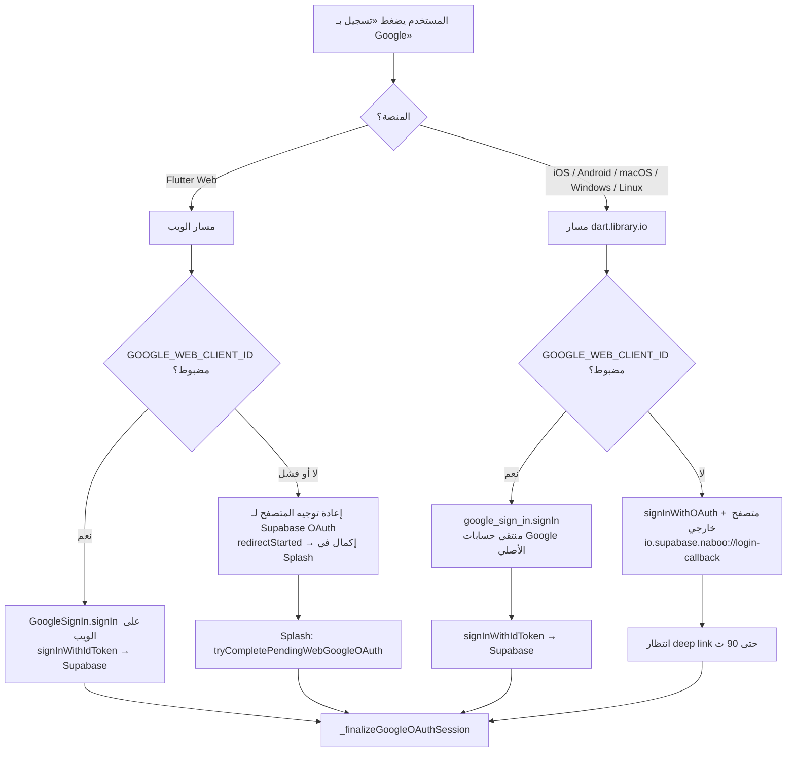
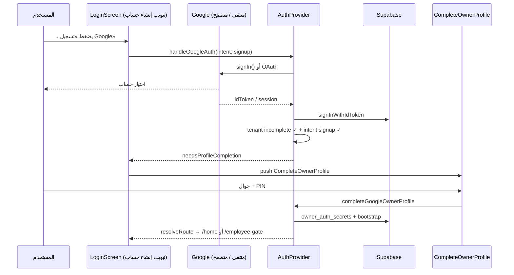
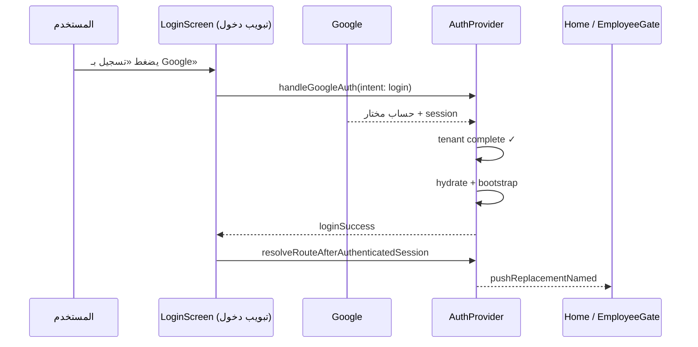

# تقرير مرجعي — تسجيل الدخول / إنشاء حساب عبر Google
## Naboo ERP — جميع المنصات (بدون تعديل كود)

**التاريخ:** 4 يوليو 2026  
**الجمهور:** صاحب منتج + مبرمج + QA  
**النطاق:** كيف يعمل Google OAuth **اليوم** في المشروع، ومقارنته بتجربة التطبيقات الاحترافية التي وصفها صاحب المنتج.

---

## 1. الملخص التنفيذي

| ما يريده صاحب المنتج | ما يفعله الكود الحالي |
|----------------------|------------------------|
| **iOS / Android:** منتقي حسابات Google على الجهاز (بدون مغادرة التطبيق) | ✅ **مُنفَّذ** عبر `google_sign_in` + `signInWithIdToken` — **شرط:** `GOOGLE_WEB_CLIENT_ID` مضبوط |
| **Windows / macOS:** فتح المتصفح لاختيار الحساب | ⚠️ **جزئياً** — الكود يجرّب **نفس مسار الموبايل** (منتقي `google_sign_in`) أولاً؛ المتصفح **احتياط** فقط إذا لم يُضبط Client ID أو فشل المنتقي |
| **بعد اختيار الحساب في «إنشاء حساب»:** انتقال مباشر للخطوة التالية | ✅ **غالباً نعم** → شاشة «إكمال الحساب» (جوال + PIN) أو OTP استعادة |
| **بعد اختيار الحساب في «تسجيل الدخول»:** دخول مباشر | ✅ **إن كان الحساب مكتملاً** → bootstrap + توجيه؛ ⚠️ **قد لا يكون «الرئيسية» مباشرة** (بوابة موظفين / onboarding) |
| **التمييز بين تبويب الدخول وتبويب التسجيل** | ✅ **مُنفَّذ** عبر `GoogleSignInIntent.login` / `signup` |

**الدالة المركزية:** `AuthProvider.handleGoogleAuth()` في `lib/providers/auth_provider.dart` (~2544).

---

## 2. خريطة المنصات — أي مسار يُستخدم؟



### جدول المنصات

| المنصة | الملف/الآلية | تجربة المستخدم المتوقعة | ملاحظة |
|--------|--------------|-------------------------|--------|
| **Android** | `native_google_id_token_sign_in_io.dart` | Sheet/منتقي حسابات Google على الجهاز | يحتاج SHA-1 في Firebase + `GOOGLE_WEB_CLIENT_ID` |
| **iOS** | نفس الملف + `REVERSED_CLIENT_ID` في Info.plist | منتقي Apple/Google على الجهاز | URL scheme: `io.supabase.naboo` |
| **macOS** | **نفس مسار io** — لا فرع منفصل للديسكتوب | منتقي Google (حسب إعدادات `google_sign_in` على macOS) | **ليس** «متصفح تلقائياً» كما في توقع المنتج |
| **Windows** | **نفس مسار io** | نافذة/منتقي Google (plugin) | مسار localhost OAuth **غير مُعالَج** (مذكور في التوثيق القديم) |
| **Linux** | **نفس مسار io** | يعتمد على plugin | نادر في الإنتاج |
| **Web (متصفح)** | `web_google_id_token_sign_in_web.dart` أو redirect | popup/redirect Google | إكمال redirect في `SplashScreen` بعد reload |

**استنتاج مهم:** الكود **لا يميّز** بين «موبايل» و«حاسوب» — أي منصة تستخدم `dart:io` تمر بنفس `_native` path. التمييز الوحيد هو `kIsWeb` vs غير الويب.

---

## 3. من الزر إلى الشاشة التالية — التدفق الكامل

### 3.1 نقطة البداية — `LoginScreen`

| العنصر | الملف | السلوك |
|--------|-------|--------|
| زر Google | `lib/screens/login_screen.dart` ~547 | `_signInWithGoogle()` |
| التبويب النشط | `_isSignUpMode` | يحدّد `GoogleSignInIntent.signup` أو `.login` |
| Overlay | `_withAuthOverlay(..., timeout: 120s)` | «جاري تسجيل الدخول بـ Google…» |

```dart
// login_screen.dart — المنطق الفعلي
final intent = _isSignUpMode
    ? GoogleSignInIntent.signup
    : GoogleSignInIntent.login;
result = await authProvider.handleGoogleAuth(intent: intent);
```

### 3.2 المرحلة A — الحصول على جلسة Supabase

**مسار المنتقي الأصلي (Android/iOS/…):**

1. `signOut()` على GoogleSignIn — **لإظهار قائمة الحسابات** (لا دخول صامت)
2. `googleSignIn.signIn()` — المستخدم يختار حساباً
3. `account.authentication` → `idToken`
4. `Supabase.auth.signInWithIdToken(provider: google, ...)`

**مسار المتصفح (احتياط):**

1. `signInWithOAuth(google, redirectTo: io.supabase.naboo://login-callback, LaunchMode.externalApplication)`
2. `_waitForGoogleOAuthSession` — حتى 3 دقائق
3. `main.dart` — `app_links` يستقبل deep link → `getSessionFromUrl`

**مسار الويب:**

- **A:** ID token مباشر (مثل الموبايل)
- **B:** `getOAuthSignInUrl` + `redirectBrowserToOAuth` → reload → `tryCompletePendingWebGoogleOAuth` في Splash

### 3.3 المرحلة B — `_finalizeGoogleOAuthSession(intent)`

هذه المرحلة تحوّل «جلسة Google ناجحة» إلى «حساب Naboo»:

| # | الخطوة | الغرض |
|---|--------|--------|
| 1 | `assert_identity_link_allowed` RPC | منع ربط بريد بحساب Google آخر |
| 2 | `_resolveTenantCloudStatus()` | هل `owner_auth_secrets` مكتمل على السحابة؟ |
| 3 | فحص **intent** vs **tenant** | login/signup mismatch |
| 4 | `_bindAccountDataScope(cloud:uid)` | عزل بيانات؛ مسح SQLite عند uid جديد |
| 5 | `upsertGoogleUserSafe` | صف محلي owner |
| 6 | `hydrateCloudAccountData` (20s) | سحب لقطة سحابية |
| 7 | `continueGoogleOwnerSessionAfterHydrate` | OTP / إكمال ملف / bootstrap |

**قواعد intent (بعد OAuth):**

| التبويب | حالة السحابة | النتيجة |
|---------|--------------|---------|
| **signup** | tenant **مكتمل** | `kGoogleAccountAlreadyExists` → «لديك حساب… سجّل الدخول» |
| **signup** | tenant **غير مكتمل** | متابعة → غالباً **إكمال الحساب** |
| **login** | tenant **غير مكتمل** | `kGoogleNoAccountFound` → «لا يوجد حساب… أنشئ حساباً» |
| **login** | tenant **مكتمل** | متابعة → **دخول** |

> **تعريف «حساب مكتمل»:** وجود سر PIN في `owner_auth_secrets` على Supabase — **ليس** مجرد وجود صف في `auth.users` (OAuth يُنشئ auth.users فوراً).

### 3.4 المرحلة C — ماذا ترى الشاشة؟

`GoogleAuthResult` → `login_screen.dart` `result.when(...)`:

| النتيجة | الشاشة التالية | «مباشر»؟ |
|---------|----------------|----------|
| `loginSuccess` | `resolveRouteAfterAuthenticatedSession()` → `/home` أو `/employee-gate` أو `/onboarding` | ✅ للحساب المكتمل؛ قد يمر ببوابة موظفين |
| `needsProfileCompletion` | `CompleteOwnerProfileScreen` (جوال + PIN) | ✅ الخطوة 2 للتسجيل الجديد |
| `pinRestoreOtpRequired` | `/owner-pin-restore-otp` | جهاز جديد + PIN على السحابة |
| `accountAlreadyExists` | SnackBar + يبقى في Login | — |
| `noAccountFound` | SnackBar + يبقى في Login | — |
| `redirectStarted` | يبقى loading (ويب) → Splash يكمل | ⚠️ ليس seamless داخل نفس الصفحة |
| `cancelled` | يغلق overlay | المستخدم ألغى المنتقي |
| `networkError` / `timeout` | SnackBar تحذير | — |

### 3.5 بعد «إكمال الحساب» (Google signup — الخطوة 2)

`CompleteOwnerProfileScreen` → `completeGoogleOwnerProfile()`:

1. حفظ جوال + PIN محلياً
2. `updateUser` metadata على Supabase
3. `_pushOwnerAuthToCloud` → `owner_auth_secrets`
4. `_completeCloudBootstrapAfterRestore`
5. `resolveRouteAfterAuthenticatedSession()` → onboarding / employee-gate / home

---

## 4. مخطط تسلسل — «إنشاء حساب» + Google (السيناريو الم ideal)



---

## 5. مخطط تسلسل — «تسجيل الدخول» + Google (حساب مكتمل)



---

## 6. متطلبات الإعداد (بدونها يتغيّر السلوك)

### 6.1 `GOOGLE_WEB_CLIENT_ID`

| | |
|--|--|
| **المصدر** | Google Cloud → OAuth 2.0 → **Web client** (نفسه في Supabase Google provider) |
| **التمرير** | `--dart-define=GOOGLE_WEB_CLIENT_ID=...` |
| **في IDE** | `.vscode/settings.json` → `dart.flutterAdditionalArgs` |
| **الغرض على الموبايل** | `GoogleSignIn.serverClientId` — **ضروري** لـ idToken على Android |
| **إن غاب** | fallback → **متصفح خارجي** + deep link (تجربة أبطأ، PKCE حساس) |

### 6.2 Android

- SHA-1 / SHA-256 في Firebase → `google-services.json`
- Deep link: `io.supabase.naboo://login-callback` في `AndroidManifest.xml`
- Package: `com.basra.storemanager`

### 6.3 iOS

- URL schemes في `Info.plist`: `io.supabase.naboo` + `REVERSED_CLIENT_ID` من Google
- Podfile / GoogleService-Info.plist

### 6.4 Supabase

- Google provider: Web Client ID + Secret
- Redirect: `https://<project>.supabase.co/auth/v1/callback`
- RPC: `assert_identity_link_allowed`, `app_get_owner_auth_secret`, `app_upsert_owner_auth_secret`

### 6.5 Web

- راجع `docs/auth/supabase_web_oauth_setup_ar.md`
- `WEB_APP_ORIGIN` للنشر
- Site URL في Supabase ≠ localhost عند الإنتاج

---

## 7. مقارنة مع التطبيقات الاحترافية (Talabat / Uber / …)

| المعيار | تطبيق احترافي typique | Naboo الحالي | الفجوة |
|---------|----------------------|--------------|--------|
| منتقي حسابات على الموبايل | ✅ | ✅ (مع Client ID) | — |
| متصفح على Desktop فقط | ✅ Win/Mac → browser | ⚠️ io path أولاً | **لا يوجد فرع `Platform.isWindows/isMacOS`** |
| دخول بضغطة واحدة بعد Google | ✅ → home | ⚠️ قد يمر `/employee-gate` أو `/onboarding` | by design (ERP multi-user) |
| signup → خطوة واحدة إضافية | ✅ phone optional | ✅ جوال + PIN إلزامي | product choice |
| لا reload على الويب | ✅ popup in-place | ⚠️ redirect يعيد تحميل الصفحة | مسار redirectStarted |
| login vs signup واضح | ✅ | ✅ intent + رسائل عربية | — |
| إلغاء Google = silence | ✅ | ✅ `cancelled` | — |

---

## 8. فجوات وknown issues (من الكود والتقارير السابقة)

| # | الموضوع | التأثير | المرجع |
|---|---------|---------|--------|
| G1 | Desktop يستخدم native وليس browser | يختلف عن توقع «Win/Mac = متصفح» | `handleGoogleAuth` لا يفحص Platform |
| G2 | `GOOGLE_WEB_CLIENT_ID` ناقص في بعض builds | fallback متصفح + PKCE fragile | `SENSITIVE_ISSUES_AUDIT_REPORT` P1-3 |
| G3 | Windows localhost callback | OAuth desktop غير مكتمل | `google_auth_implementation.md` §4 |
| G4 | بعد Google login ليس دائماً `/home` | owner → employee-gate أولاً | `resolveRouteAfterAuthenticatedSession` |
| G5 | hydrate مزدوج (splash + login) | بطء إقلاع (أُصلح جزئياً بـ `resolveStartupRouteLight`) | splash + auth |
| G6 | PIN المالك لا يُزامَن تلقائياً بين الأجهزة | جهاز جديد → OTP أو إكمال ملف | `google_auth_implementation.md` F1 |
| G7 | ويب: `redirectStarted` يكمل في Splash | المستخدم يرى splash ثم login/home | `tryCompletePendingWebGoogleOAuth` |

---

## 9. ملفات الكود — فهرس سريع

| الموضوع | الملف |
|---------|-------|
| Orchestrator | `lib/providers/auth_provider.dart` — `handleGoogleAuth`, `_finalizeGoogleOAuthSession` |
| Intent | `lib/models/google_sign_in_intent.dart` |
| Native picker | `lib/services/auth/native_google_id_token_sign_in_io.dart` |
| Web ID token | `lib/services/auth/web_google_id_token_sign_in_web.dart` |
| Config | `lib/config/google_oauth_config.dart` |
| UI + routing | `lib/screens/login_screen.dart` |
| Profile step 2 | `lib/screens/auth/complete_owner_profile_screen.dart` |
| Deep link | `lib/main.dart` — `_registerMobileOAuthDeepLinkHandler` |
| Result types | `lib/models/google_auth_result.dart` |
| إعداد Android/iOS | `docs/auth/google_oauth_setup.md` |
| إعداد Web | `docs/auth/supabase_web_oauth_setup_ar.md` |
| توثيق قديم شامل | `docs/auth/google_auth_implementation.md` |

---

## 10. قائمة QA — التحقق اليدوي

### Android / iOS (مع `GOOGLE_WEB_CLIENT_ID`)

- [ ] تبويب **إنشاء حساب** → Google → منتقي حسابات **داخل التطبيق**
- [ ] حساب Google **جديد** → «إكمال الحساب» (جوال + PIN) → home/gate
- [ ] تبويب **تسجيل الدخول** → Google → حساب **موجود** → دخول بدون إكمال ملف
- [ ] signup + حساب موجود → «لديك حساب مسجل…»
- [ ] login + حساب غير موجود → «لا يوجد حساب…»
- [ ] إلغاء المنتقي → لا crash، overlay يُغلق

### Windows / macOS

- [ ] هل يظهر **منتقي Google** أم **متصفح**؟ (سجل النتيجة — الكود الحالي: منتقي أولاً)
- [ ] إن فُتح متصفح: هل يعود deep link `io.supabase.naboo://…`؟

### Web

- [ ] ID token path يعمل بدون redirect لـ localhost
- [ ] إن redirect: Splash يكمل OAuth ويوجه للوجين/الملف

---

## 11. خلاصة لصاحب المنتج

1. **الموبايل (iOS/Android)** مُصمَّم ليعمل كما تريد — **منتقي حسابات الجهاز** — بشرط ضبط `GOOGLE_WEB_CLIENT_ID` و Firebase/iOS.
2. **الحاسوب (Windows/Mac)** الكود **لا يفتح المتصفح تلقائياً**؛ يستخدم نفس plugin الموبايل. للسلوك «متصفح على Desktop فقط» يلزم **قرار تصميم + تعديل لاحق** (غير موجود اليوم).
3. **بعد اختيار الحساب:** التطبيق **يميّز** login/signup وينقلك للخطوة المنطقية (إكمال ملف / OTP / دخول). «الدخول المباشر» للمالك قد يمر **بوابة الموظفين** — هذا سلوك ERP وليس bug OAuth.
4. **التجربة الأكثر احترافية على الموبايل** تعتمد على: Client ID + SHA-1 + عدم fallback للمتصفح.

---

*تقرير مرجعي — مبني على قراءة الكود بتاريخ 4 يوليو 2026. لا يتضمن تعديلات.*
