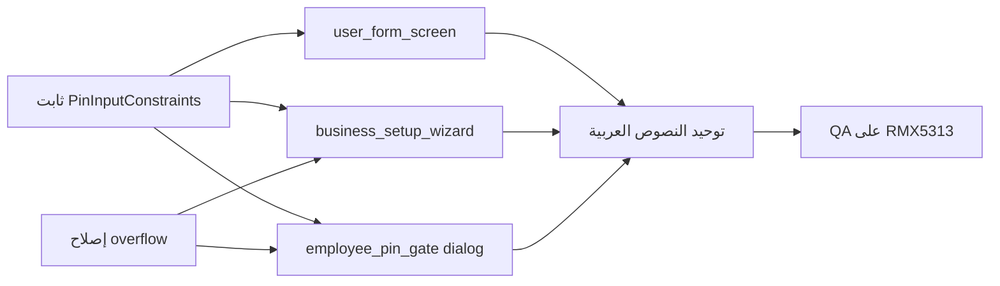

# تقرير فحص رمز PIN — تجربة الإدخال والاتساق
## Naboo ERP — 4 يوليو 2026

**الجهاز:** RMX5313 (Android 15) عبر scrcpy  
**السياسة المتفق عليها:** رمز PIN = **4 أرقام بالضبط** (`^\d{4}$`) — لا حروف، لا أكثر من 4  
**المرجع التقني:** `lib/utils/auth_validators.dart` → `AuthValidators.isValidPin`  
**مرتبط بـ:** `SENSITIVE_ISSUES_AUDIT_REPORT.md` · `REMEDIATION_WORK_PLAN.md` (المرحلة 6)

---

## 1. الملخص التنفيذي

| المستوى | العدد | الوصف |
|---------|-------|--------|
| **P0** | 3 | شاشات تسمح بإدخال غير PIN (حروف / >4 أرقام) أو تحفظ PIN غير صالح |
| **P1** | 4 | مصطلحات خاطئة («كلمة مرور» بدل PIN) + overflow في التخطيط |
| **P2** | 2 | شاشات صحيحة في الكود لكن تحتاج توحيد UX |

**الخلاصة:** المنطق المركزي (`AuthValidators.isValidPin`) صحيح، لكن **طبقة الواجهة غير موحّدة** — بعض الشاشات تطبّق القيد عند الكتابة، وبعضها يكتفي بـ `length >= 4` أو لا يقيّد الإدخال أصلاً.

---

## 2. خريطة الصور → المشاكل → الإصلاح

### صورة 1 — إعداد سريع: «إنشاء الكاشير الأول» (23:04)


| # | المشكلة الظاهرة | السبب في الكود | الأولوية |
|---|----------------|----------------|----------|
| 1.1 | **BOTTOM OVERFLOWED BY 21 PIXELS** عند فتح لوحة المفاتيح | `_buildCashierStep()` داخل `Column` بـ `mainAxisAlignment: center` بدون `SingleChildScrollView` — `resizeToAvoidBottomInset` لا يكفي | P1 |
| 1.2 | يمكن إدخال **أكثر من 4 أرقام** في حقل PIN | `FilteringTextInputFormatter.digitsOnly` فقط — **لا** `LengthLimitingTextInputFormatter(4)` | **P0** |
| 1.3 | لا يُرفض PIN غير مكتمل (مثلاً 3 أرقام) عند الحفظ | `_finishWizard()` يتحقق من `trim().isEmpty` فقط — **لا** `AuthValidators.isValidPin` | **P0** |

**الملف:** `lib/screens/onboarding/business_setup_wizard_screen.dart` (حوالي 519–536، 235)

**الإصلاح المقترح:**
- لفّ محتوى خطوة الكاشير في `SingleChildScrollView` + `padding: EdgeInsets.only(bottom: MediaQuery.viewInsetsOf(context).bottom)`
- إضافة `LengthLimitingTextInputFormatter(4)` + `textDirection: TextDirection.ltr`
- عند `_finishWizard`: `if (!AuthValidators.isValidPin(_cashierPinCtrl.text))` → SnackBar «رمز PIN يجب أن يكون 4 أرقام»

---

### صورة 2 — بوابة الموظف: حوار «مصادقة المالك» (23:04)


| # | المشكلة الظاهرة | السبب في الكود | الأولوية |
|---|----------------|----------------|----------|
| 2.1 | لوحة مفاتيح **عربية كاملة** (حروف + أرقام) | `TextField` بدون `keyboardType` ولا `inputFormatters` | **P0** |
| 2.2 | تسمية «**كلمة المرور**» بدل «رمز PIN» | `labelText: 'كلمة المرور'` + نص «كلمة مرور صاحب العمل» | P1 |
| 2.3 | لا حد أقصى للطول | لا `maxLength` ولا `LengthLimitingTextInputFormatter` | **P0** |

**الملف:** `lib/screens/auth/employee_pin_gate_screen.dart` → `_onAddUserTap()` (حوالي 555–597)

**الإصلاح المقترح (خيار أ — موصى به):** استبدال `TextField` بـ **لوحة PIN رقمية** (نفس `_buildNumpadButton` الموجودة في الشاشة) داخل الحوار — 4 نقاط + أرقام فقط.

**خيار ب (أقل جهداً):** `keyboardType: TextInputType.number` + `digitsOnly` + `maxLength: 4` + `AuthValidators.isValidPin` قبل `_db.verifyPinForUser`.

**توحيد النصوص:**
- «الرجاء إدخال **رمز PIN** لصاحب العمل لإنشاء مستخدم جديد.»
- «رمز PIN غير صحيح» بدل «كلمة المرور غير صحيحة»

---

### صورة 3 — إدارة المستخدمين: «مستخدم جديد» (23:05)


| # | المشكلة الظاهرة | السبب في الكود | الأولوية |
|---|----------------|----------------|----------|
| 3.1 | النص يقول «**4-6 أرقام**» | `subtitle: 'رمز رقمي من 4-6 أرقام...'` | P1 |
| 3.2 | يمكن إدخال **5 أو 6 أرقام** | `LengthLimitingTextInputFormatter(6)` | **P0** |
| 3.3 | التحقق يقبل 4–6 (`length < 4` فقط) | `_save()` و `validator`: «4 أرقام على الأقل» — **لا** `isValidPin` | **P0** |
| 3.4 | على بعض الأجهزة قد تظهر لوحة غير رقمية | `keyboardType: TextInputType.number` بدون `obscuringCharacter` موحّد | P2 |

**الملف:** `lib/screens/users/user_form_screen.dart` (334–373، 143–178)

**الإصلاح المقترح:**
- تغيير النص إلى: «رمز رقمي من **4 أرقام** يستخدمه الموظف لتسجيل الدخول.»
- `LengthLimitingTextInputFormatter(4)` في الحقلين
- `validator` و `_save`: `AuthValidators.isValidPin(v)` → «رمز PIN يجب أن يكون 4 أرقام بالضبط»

---

### صورة 4 — بوابة الموظف: لوحة PIN للمالك (23:05)


| # | المشكلة الظاهرة | السبب في الكود | **الأولوية** |
|---|----------------|----------------|----------|
| 4.1 | **RIGHT OVERFLOWED BY 148 PIXELS** مع اسم طويل | `Row` في `_buildPinEntryHeader`: `Text(name)` بدون `Expanded`/`Flexible` + `fontSize: 24` | P1 |
| 4.2 | «**كلمة مرور** صاحب العمل» بدل PIN | `role == 'owner' ? 'أدخل كلمة مرور صاحب العمل'` | P1 |
| 4.3 | رسالة خطأ مختلطة | `'كلمة المرور أو رمز الدخول غير صحيح...'` | P1 |
| 4.4 | عدد النقاط | الكود يستخدم `List.generate(4, ...)` — صحيح؛ أي اختلاف بصري قد ينتج عن الـ overflow | — |

**الملف:** `lib/screens/auth/employee_pin_gate_screen.dart` (1035–1088، 205)

**الإصلاح المقترح:**
- لفّ اسم المستخدم في `Expanded(child: Text(name, maxLines: 1, overflow: TextOverflow.ellipsis))`
- استبدال `Column` بجانب الاسم أو تقليل `fontSize` على الشاشات الضيقة
- توحيد النص: «أدخل **رمز PIN** (4 أرقام)» للمالك والموظف
- رسالة خطأ: «رمز PIN غير صحيح»

---

### صورة 5 — شاشة تسجيل الدخول (23:07)


| # | الحالة | الملاحظة |
|---|--------|----------|
| 5.1 | **صحيح في الكود** | `digitsOnly` + `LengthLimitingTextInputFormatter(4)` + `AuthValidators.isValidPin` |
| 5.2 | تحسين اختياري | بعض لوحات Android لـ `TextInputType.number` تعرض رموزاً — يمكن `FilteringTextInputFormatter.digitsOnly` (موجود) |

**الملف:** `lib/screens/login_screen.dart` (948–963)

**الإجراء:** تضمين في **مكوّن PIN الموحّد**؛ لا تغيير سلوكي مطلوب إن بقي الحقل كما هو.

---

### صورة 6 — إنشاء حساب جديد (23:07)


| # | الحالة | الملاحظة |
|---|--------|----------|
| 6.1 | **صحيح في الكود** | PIN + تأكيد: `digitsOnly` + حد 4 + `isValidPin` في التحقق |
| 6.2 | زر معطّل حتى اكتمال النموذج | سلوك متوقع — الزر رمادي حتى PIN صالح |

**الملف:** `lib/screens/login_screen.dart` (1287–1375)

**الإجراء:** مرجع للتوحيد — لا إصلاح P0.

---

## 3. جدول اتساق الشاشات

| الشاشة | أرقام فقط عند الكتابة | حد 4 | `isValidPin` عند الحفظ | مصطلح PIN | الحالة |
|--------|----------------------|------|------------------------|-----------|--------|
| `login_screen` (دخول) | ✅ | ✅ | ✅ | ✅ | OK |
| `login_screen` (تسجيل) | ✅ | ✅ | ✅ | ✅ | OK |
| `complete_owner_profile_screen` | ✅ | ✅ | ✅ | ✅ | OK |
| `reset_password_screen` | ✅ | ✅ | ✅ | ✅ | OK |
| `employee_pin_gate` (لوحة) | ✅ (numpad) | ✅ | ✅ | ❌ «كلمة مرور» | P1 |
| `employee_pin_gate` (حوار إضافة) | ❌ | ❌ | ❌ | ❌ | **P0** |
| `user_form_screen` | جزئي | ❌ (6) | ❌ (≥4) | ❌ «4-6» | **P0** |
| `business_setup_wizard` | جزئي | ❌ | ❌ | ✅ | **P0** |
| `open_shift_screen` (كلمة مرور وردية) | ❓ | ❓ | ❓ | ❌ «كلمة مرور» | P2 — مراجعة لاحقة |

---

## 4. الحل المعماري الموصى به

### 4.1 ثابت مشترك (ملف جديد أو توسيع `auth_validators.dart`)

```dart
// lib/utils/pin_input_constraints.dart (مقترح)
abstract final class PinInputConstraints {
  static const length = 4;
  static List<TextInputFormatter> get formatters => [
    FilteringTextInputFormatter.digitsOnly,
    LengthLimitingTextInputFormatter(length),
  ];
  static String? validateField(String? value, {bool required = true}) { ... }
}
```

### 4.2 ترتيب التنفيذ



### 4.3 اختبارات

| # | سيناريو | النتيجة المتوقعة |
|---|---------|------------------|
| T1 | كتابة حرف في حقل PIN (user form) | **لا يُقبل** |
| T2 | لصق «12345» | يبقى «1234» فقط |
| T3 | حفظ PIN «123» | رسالة «4 أرقام» — **لا** حفظ |
| T4 | حوار مصادقة المالك | لوحة أرقام فقط |
| T5 | اسم طويل في employee gate | لا overflow |
| T6 | onboarding + لوحة مفاتيح | لا BOTTOM OVERFLOW |

```bash
flutter test test/auth/   # إضافة unit tests لـ PinInputConstraints
flutter analyze lib/screens/users/ lib/screens/onboarding/ lib/screens/auth/employee_pin_gate_screen.dart
```

---

## 5. الأولويات

| ID | المشكلة | الأولوية | الجهد |
|----|---------|----------|-------|
| PIN-P0-1 | `user_form_screen`: 4–6 → 4 بالضبط | **P0** | 30m |
| PIN-P0-2 | `business_setup_wizard`: حد 4 + تحقق | **P0** | 45m |
| PIN-P0-3 | حوار مصادقة المالك: أرقام فقط | **P0** | 1–2h |
| PIN-P1-1 | overflow onboarding (scroll) | P1 | 30m |
| PIN-P1-2 | overflow employee gate (اسم طويل) | P1 | 30m |
| PIN-P1-3 | توحيد «رمز PIN» بدل «كلمة مرور» | P1 | 45m |
| PIN-P2-1 | `PinInputConstraints` + widget اختياري | P2 | 1h |
| PIN-P2-2 | مراجعة `open_shift_screen` | P2 | 1h |

---

## 6. علاقة بالتقرير السابق

هذه المشاكل **مستقلة** عن P0-1/P0-2/P0-3 (جلسة Google، UNIQUE profile، SQL خام) لكنها **تظهر في نفس رحلة المستخدم** (إعداد أول → بوابة موظف → إدارة مستخدمين).  
يُنفَّذ **المرحلة 6** في `REMEDIATION_WORK_PLAN.md` **قبل** QA النهائي (المرحلة 5) أو **بالتوازي** معها.

---

*آخر تحديث: 4 يوليو 2026 — بناءً على 6 لقطات شاشة من RMX5313*
