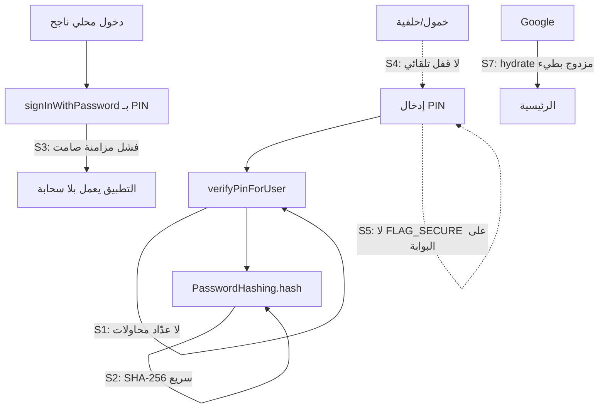

# تقرير الجاهزية الاحترافية — طبقة المصادقة والدخول
## Naboo ERP — «ما الذي يفصلنا عن تطبيق بمستوى 10,000$؟»

**التاريخ:** 6 يوليو 2026  
**النوع:** تحليل وقراءة كود فقط — **بدون أي تعديل على الكود**  
**النطاق:** المصادقة، الجلسات، PIN، Google، التخزين الآمن، وجودة الهندسة المحيطة  
**المنهج:** قراءة مباشرة للكود (`auth_provider.dart`، `db_users.dart`، `password_hashing.dart`، `secure_session_storage.dart`، `employee_pin_gate_screen.dart`، `login_screen.dart`) + دمج نتائج التقارير السابقة.

---

## 1. الرسالة الصريحة أولاً (بودّية)

بنيتَ **أساساً قوياً فعلاً**؛ أشياء كثيرة هنا تفوق تطبيقات تجارية منتشرة:

**ما هو ممتاز اليوم:**
- عزل tenant صارم + ربط جهاز (`account_devices`) مع إلغاء وصول فوري عبر Realtime
- جلسة Supabase في **Keychain / EncryptedSharedPreferences** مع ترحيل تلقائي وكشف فشل الـ Keychain (`secure_session_storage.dart`)
- `AppLogger` مع **تنقيح تلقائي** للأسرار (JWT / password / OTP) + اختبار يمنع أي `debugPrint` غير محمي
- Google OAuth بمسار intent (login/signup) + RPC يمنع تصادم الهويات
- سجل تدقيق (`business_audit_events`) للعمليات الحساسة
- PIN موحّد 4 أرقام (مرحلة 6) + إخفاء أخطاء SQL عن المستخدم (مرحلة 3)

**لكن** — وهذا جواب سؤالك المباشر — توجد **ثغرتان حرجتان (P0)** ومجموعة فجوات، لو رآها مراجع أمني أو مشترٍ تقني لقال فوراً: «هذا لم يخضع لمراجعة أمنية». كلها قابلة للإصلاح دون إعادة بناء.

**التقييم الإجمالي:**

| المحور | الدرجة | ملاحظة |
|--------|--------|--------|
| العزل والهندسة (tenant/device) | 9/10 | ممتاز |
| تخزين الجلسة والأسرار | 8/10 | جيد جداً |
| **مقاومة الهجوم (brute force / rate limit)** | **3/10** | **الفجوة الأكبر** |
| **قوة تجزئة PIN** | **4/10** | SHA-256 بلا تمديد |
| تجربة الدخول (UX احترافي) | 6/10 | بطء + خطوات |
| جاهزية الإطلاق (build/secrets) | 6/10 | يعتمد على IDE config |

---

## 2. الثغرات الحرجة (P0)

### 🔴 S1 — لا حدّ لمحاولات PIN (Brute Force مفتوح بالكامل)

**أخطر ما في التطبيق حالياً.** بحث شامل عن `failedAttempts` / `lockout` / `attemptCount` / `cooldown` / `rateLimit` في `lib/` أعاد **صفر نتائج** في أي مسار تحقق.

**الدليل — `verifyPinForUser` يتحقق ويعيد فوراً بلا أي عدّاد:**

```911:925:lib/services/db_users.dart
  Future<bool> verifyPinForUser(int userId, String pin) async {
    final db = await database;
    final rows = await db.query(
      'users',
      where: 'id = ? AND isActive = 1',
      whereArgs: [userId],
      limit: 1,
    );
    if (rows.isEmpty) return false;
    final row = rows.first;
    final salt = (row['passwordSalt'] as String?)?.trim() ?? '';
    final hash = (row['passwordHash'] as String?)?.trim() ?? '';
    if (salt.isEmpty || hash.isEmpty) return false;
    return PasswordHashing.verify(pin, salt, hash);
  }
```

**وفي بوابة الموظف، بعد الفشل يُمسح الحقل فوراً ويُعاد المحاولة بلا عقوبة:**

```200:203:lib/screens/auth/employee_pin_gate_screen.dart
      _verifying = false;
      if (role != 'owner') _pin = '';
```

**لماذا هذا خطير جداً هنا تحديداً:**
- PIN = **4 أرقام فقط** → فضاء المفاتيح **10,000 احتمال** فقط.
- لا تأخير، لا قفل، لا عدّاد → مهاجم لديه الجهاز (أو سكربت) يجرّب **كل الاحتمالات في دقائق**.
- التطبيق **مالي** (صندوق، فواتير، ديون) → اختراق PIN = وصول كامل لبيانات المتجر.

**المعيار الاحترافي:** بعد 5 محاولات خاطئة → تأخير تصاعدي (backoff) ثم قفل مؤقت (مثلاً 30 ثانية → دقيقة → 5 دقائق)، مع تسجيل المحاولات في `business_audit_events`.

**الأثر إن بقي:** يسقط التطبيق في أي **penetration test** أو مراجعة App Store/Play الأمنية الجادة.

---

### 🔴 S2 — تجزئة PIN بـ SHA-256 عارية (بلا key-stretching)

**الدليل:**

```14:17:lib/services/password_hashing.dart
  static String hash(String password, String salt) {
    final digest = sha256.convert(utf8.encode('$salt:${password.trim()}'));
    return digest.toString();
  }
```

**المشكلة:** SHA-256 دالة **سريعة جداً** — صُمّمت للسرعة لا لمقاومة التخمين. مع PIN من 4 أرقام:
- GPU عادي يحسب **مليارات SHA-256/ثانية**.
- لو تسرّب ملف SQLite (`users.passwordHash/passwordSalt`) من جهاز، يُكسر الـ 10,000 احتمال **فورياً** رغم وجود salt (الـ salt يمنع rainbow tables لكن لا يبطئ التخمين المستهدف).

**التعليق في الكود نفسه يعترف بالحدود:** «مناسبة للتخزين المحلي فقط».

**المعيار الاحترافي:** خوارزمية **بطيئة مصمَّمة لكلمات السر** — الأفضل `Argon2id`، وإلا `PBKDF2` بعدد تكرارات عالٍ (≥100k)، أو `scrypt`. هذه ترفع تكلفة كل محاولة تخمين آلاف المرات.

> **ملاحظة:** الحزمة `crypto` الحالية لا توفّر Argon2؛ يلزم قرار حزمة (`pointycastle` لـ PBKDF2، أو `argon2` عبر FFI). لهذا وضعته P0 للتحليل لكن تنفيذه يحتاج موافقتك على تبعية جديدة.

**العلاقة بين S1 و S2:** S1 يحمي **المحاولات الحيّة** على الجهاز، وS2 يحمي **الملف المسروق**. المحترف يعالج الاثنين — فبدون S1 لا يحتاج المهاجم أصلاً لكسر الـ hash؛ يجرّب مباشرة.

---

## 3. الفجوات العالية (P1)

### 🟠 S3 — عدم اتساق في «كلمة سر Supabase الداخلية» = فشل مزامنة صامت

موثّق سابقاً كـ **F4** في `google_auth_implementation.md`. بعد دخول PIN محلي، بعض المسارات تحاول `signInWithPassword` بـ PIN بينما كلمة سر Supabase مختلفة → **الدخول المحلي ينجح لكن السحابة لا تُفعَّل بصمت**. وجدته حياً في مسار تأكيد المالك أيضاً:

```2833:2836:lib/providers/auth_provider.dart
      await Supabase.instance.client.auth.signInWithPassword(
        email: email,
        password: trimmed,
      );
```
هنا `trimmed` هو PIN المُدخل — يعمل **فقط** إذا كان PIN = كلمة سر Supabase، وهذا ليس مضموناً لحسابات Google/OTP.

**الأثر:** «التطبيق يعمل لكن لا يزامن» — من أصعب الأعطال على المستخدم فهمها، ويضرب الإحساس بالاحترافية.

### 🟠 S4 — لا قفل تلقائي عند الخمول (Idle Lock)

بحث `idleLock` / `autoLock` / `lockAfter` → **لا شيء**. تطبيق مالي احترافي يقفل نفسه (يعود لبوابة PIN) بعد فترة خمول أو عند إرسال التطبيق للخلفية. غيابه يعني: جهاز مفتوح على طاولة = وصول كامل.

### 🟠 S5 — لا حماية شاشة (FLAG_SECURE) على بوابة PIN وشاشة فتح الوردية

`SecureScreen` مطبّق على شاشات (login، OTP، الإعدادات، تفعيل الترخيص…) لكن **بوابة الموظف `employee_pin_gate_screen.dart`** و**فتح الوردية `open_shift_screen.dart`** — حيث يُدخل PIN فعلياً — **لا تستخدمه** (تأكّدتُ بالبحث). النتيجة: لقطة شاشة / تسجيل شاشة قد يلتقط لوحة PIN.

### 🟢 S6 — cooldown إعادة إرسال OTP — **تبيّن لاحقاً أنه منفّذ** ✅

> **تصحيح بعد فحص أعمق (6 يوليو):** الشاشات الثلاث (`email_otp_screen.dart`، `forgot_password_otp_screen.dart`، `owner_pin_restore_otp_screen.dart`) **تحتوي فعلاً** على عدّاد 60 ثانية (`_resendCountdown` + `_startCountdown`) يعطّل زر إعادة الإرسال. لا حاجة لأي عمل. تُركت هنا للسجل فقط.

---

## 4. الفجوات المتوسطة (P2) — تلميع الاحترافية

| # | الملاحظة | الدليل/الموضع | الأثر |
|---|----------|---------------|-------|
| S7 | الدخول بعد Google بطيء (hydrate مزدوج 20s+35s) | موثّق GAP-2 في `AUTH_SIMPLE_POLICY_PLAN_V1.md` | إحساس بالبطء |
| S8 | `GOOGLE_WEB_CLIENT_ID` في `.vscode` فقط | build إنتاج بدونه → متصفح بدل نافذة الحسابات | تجربة سيئة بالإصدار |
| S9 | رسالة «لديك حساب» لا تنقل للتبويب تلقائياً | `login_screen.dart` `accountAlreadyExists` | أقل سلاسة من التطبيقات العالمية |
| S10 | لا فحص «PIN ضعيف» (1234 / 0000 / 1111) | لا توجد قائمة رفض في `PinInputConstraints` | PIN يمكن تخمينه بسهولة |
| S11 | `verify` غير ثابت الزمن (`==` على السلسلة) | `password_hashing.dart:21` | timing side-channel (نظري، محلي — منخفض) |
| S12 | لا توثيق لسياسة انتهاء الجلسة للمستخدم | — | شفافية |

---

## 5. الخريطة البصرية — أين الثغرات في رحلة الدخول



---

## 6. جدول الأولويات المقترح (للتنفيذ لاحقاً — ليس الآن)

| # | الثغرة | الخطورة | الجهد التقديري | يحتاج قراراً منك؟ |
|---|--------|---------|----------------|--------------------|
| S1 | حد محاولات PIN + backoff + قفل | **P0** | 4–6h | لا — تنفيذ مباشر |
| S2 | تقوية تجزئة PIN (Argon2/PBKDF2) | **P0** | 6–8h + ترحيل | **نعم — تبعية جديدة + ترحيل hash قديم** |
| S3 | توحيد جلسة السحابة (ensureFreshSession بدل PIN) | P1 | 3–4h | لا |
| S4 | قفل تلقائي عند الخمول/الخلفية | P1 | 3h | نعم — مدة القفل |
| S5 | FLAG_SECURE على بوابة PIN + فتح الوردية | P1 | 30m | لا |
| S6 | cooldown إعادة إرسال OTP | P1 | 1h | لا |
| S7 | إلغاء hydrate المزدوج | P2 | 2–3h | لا |
| S8 | dart-define في build الإنتاج | P2 | 30m | لا |
| S9 | انتقال تلقائي بين تبويبي الدخول/التسجيل | P2 | 30m | لا |
| S10 | رفض PIN الضعيف الشائع | P2 | 1h | نعم — هل نمنع 1234؟ |
| S11 | مقارنة hash ثابتة الزمن | P2 | 30m | لا |

**ملاحظة توافق:** S1 وS5 وS6 وS8 وS9 و S11 كلها **تعديلات محلية آمنة** بلا ترحيل بيانات. S2 وحده يتطلب استراتيجية ترحيل (إعادة تجزئة PIN عند أول دخول ناجح).

---

## 7. أهم 3 خطوات لو أردت أقصى أثر بأقل جهد

1. **S1 (حد المحاولات):** أكبر قفزة أمنية مقابل الجهد — يحوّل الـ brute force من «دقائق» إلى «مستحيل عملياً»، حتى مع بقاء SHA-256.
2. **S5 (FLAG_SECURE على بوابة PIN):** 30 دقيقة، ويسدّ تسريب PIN عبر لقطات الشاشة.
3. **S3 (توحيد جلسة السحابة):** يقتل عطل «يعمل لكن لا يزامن» الذي يُفقد الثقة بالتطبيق.

هذه الثلاث وحدها ترفع الانطباع من «مشروع جيد» إلى «منتج مُصان أمنياً».

---

## 8. ما راجعته وخلص أنه **سليم** (طمأنة)

- تخزين توكن Supabase: آمن + fallback واعٍ عند فشل Keychain ✅
- تنقيح الأسرار في اللوغ: قوي ومُختبَر ✅
- منع الدخول الشبح بعد حذف الحساب (`_blockGhostLoginIfCloudDead`) ✅
- منع تصادم هوية Google (RPC + `upsertGoogleUserSafe`) ✅
- عزل tenant في الاستعلامات ✅
- salt عشوائي `Random.secure()` لكل مستخدم ✅ (المشكلة في سرعة الدالة لا في الـ salt)

---

## 9. الخلاصة لصاحب المنتج

التطبيق **ليس هشاً معمارياً** — العزل والجلسات والهوية مبنية باحتراف. لكن طبقة **مقاومة الهجوم على PIN** (حد المحاولات + قوة التجزئة) هي **الحلقة المفقودة** التي تفصل بين «تطبيق يعمل» و«تطبيق يجتاز مراجعة أمنية بقيمة 10,000$+».

الأولوية القصوى — وبفارق كبير — هي **S1 (حد المحاولات)**، لأنها تحمي مباشرةً أخطر سطح هجوم (PIN من 4 أرقام) وتُنفَّذ بلا تبعيات ولا ترحيل.

---

*تقرير تحليلي — قراءة كود فقط بتاريخ 6 يوليو 2026. لم يُعدَّل أي سطر. التنفيذ ينتظر قرارك على البنود التي تحتاج موافقة (S2, S4, S10).*
