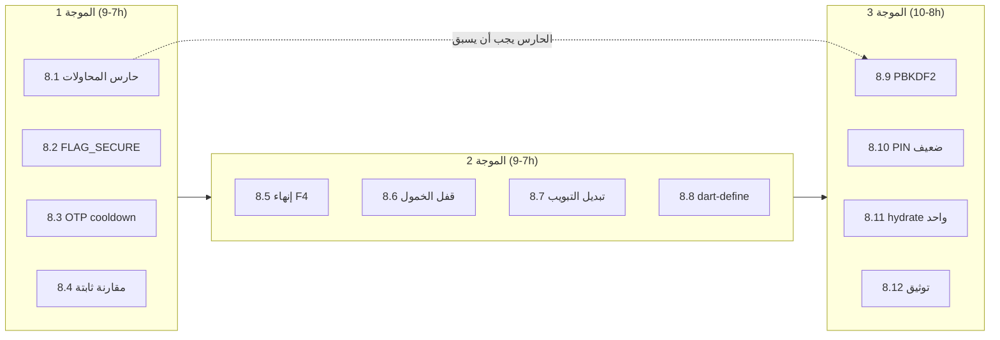

# خطة المعالجة الشاملة — S1 إلى S12
## المرحلة 8: رفع طبقة المصادقة إلى المستوى الاحترافي

**التاريخ:** 6 يوليو 2026  
**المرجع:** `docs/auth/PROFESSIONAL_GRADE_AUDIT_V1.md` (التدقيق الذي حدد S1–S12)  
**الحالة:** ✅ **كل الموجات (1، 2، 3) مكتملة ومختبَرة** — S1–S12 منجزة  
**الجهد الكلي التقديري:** ‎22–28 ساعة عمل موزعة على 3 موجات

> **تحديث تنفيذ (6 يوليو 2026):** أُنجزت الموجة الأولى بالكامل:
> - **S1** `PinAttemptGuard` (ملف `lib/services/auth/pin_attempt_guard.dart`) مدموج في بوابة الموظف، حوار مصادقة المالك، `login()`، `verifyOwnerConfirmationCredential`، وشاشة فتح الوردية (موقعان). قفل تصاعدي 30ث→60ث→5د→15د بعد 5 محاولات، يصمد بعد إعادة التشغيل، مع تسجيل `pin_lockout` في سجل التدقيق وعدّاد تنازلي حي في الواجهة.
> - **S5** `SecureScreen` (FLAG_SECURE) أُضيف على بوابة PIN وشاشة فتح الوردية.
> - **S11** مقارنة hash ثابتة الزمن `constantTimeEquals` في `password_hashing.dart`.
> - **S6** تبيّن أن عدّاد إعادة إرسال OTP (60 ثانية) **منفّذ مسبقاً** في الشاشات الثلاث — لا حاجة لعمل.
> - اختبارات: `test/auth/pin_attempt_guard_test.dart` + `test/auth/password_hashing_test.dart` (18 اختباراً كلها خضراء). `dart analyze` بلا أخطاء جديدة.
>
> **تحديث الموجة 2 (6 يوليو 2026):** أُنجزت بالكامل:
> - **S3** أُزيل نمط F4 من `verifyOwnerConfirmationCredential` — التحقق السحابي الآن عبر `OwnerAuthCloudService.fetch()` + `PasswordHashing.verify` مقابل hash/salt، لا عبر `signInWithPassword` بالـ PIN. (تأكّد أن `_attemptSupabasePasswordSignIn` يستخدم كلمة السر الداخلية المخزّنة لا الـ PIN — سليم.)
> - **S9** انتقال تلقائي بين التبويبين: `_setSignUpMode` يُستدعى في `accountAlreadyExists` (→ الدخول) و`noAccountFound` (→ التسجيل) في `login_screen.dart`.
> - **S4** قفل الخمول الأمني: أُضيف `lockRequiresPin` (افتراضياً مفعّل) إلى `IdleTimeoutProvider`؛ عند الاستيقاظ من السكون مع الجهاز مربوطاً بمالك → `lockSession()` + التوجيه إلى `/employee-gate`. مفتاح تحكّم في `settings_screen.dart`. (البنية الأساسية — `IdleSessionShell` + `IdleScreensaver` — كانت موجودة كشاشة سكون تجميلية؛ رُقّيت إلى قفل أمني.)
> - **S8** `env/prod.env.example` + `env/README.md` + استثناء في `.gitignore` + تحذير إقلاع في `main.dart` عند غياب `GOOGLE_WEB_CLIENT_ID`.
> - كل اختبارات `test/auth/` (32) خضراء. `dart analyze` على ملفات الموجة بلا أخطاء جديدة.
>
> **تحديث الموجة 3 (6 يوليو 2026):** أُنجزت بالكامل:
> - **S2** ترقية التجزئة إلى **PBKDF2-HMAC-SHA256 (150k تكرار)** عبر `pointycastle`، بصيغة مُصدَّرة `pbkdf2$<iterations>$<hashB64>`، والحساب داخل `compute()` (isolate). `verifyPin` يدعم الصيغتين، و**ترقية انتهازية** تلقائية للـ hash القديم عند أول تحقق ناجح (في `verifyPinForUser` و`login`). كل مواقع الإنشاء الثمانية تحوّلت إلى `hashPin`. الصيغة القديمة تبقى مقروءة للأبد — لا مستخدم محبوس.
> - **S10** `PinInputConstraints.isWeak` يرفض التكرار (0000) والتسلسل (1234/4321/0123/3210) عند الإنشاء/التغيير فقط.
> - **S7** بوابة الموظف تتخطّى الترطيب الكامل إذا كان هناك سحب سحابي حديث (`hasFreshCloudPull`) — يمنع الترطيب المزدوج بعد Google.
> - **S12** قسم «الأمان والجلسة» في `docs/USER_GUIDE.md`.
> - اختبارات جديدة لصيغة PBKDF2 والترقية والرموز الضعيفة. **38 اختبار auth كلها خضراء**، `dart analyze lib` بلا أي أخطاء.
>
> ### ملاحظة أمنية — `shiftAccessPin` (✅ مُعالَج 6 يوليو 2026)
> **العمود ليس PIN دخول التطبيق** — كان في الأصل رمز هوية منفصل لبطاقات QR للوردية (`shiftAccessPin` ≠ `passwordHash`/`passwordSalt`).  
> **الخلل:** مسار `updateOwnerGoogleProfileCredentials` كان يخزّن **PIN الدخول** بالخطأ في `shiftAccessPin` (نص صريح). **الإصلاح:** يُولَّد رمز عشوائي (`newRandomShiftAccessPin`)؛ PIN الدخول يبقى في `passwordHash`/`passwordSalt` فقط (PBKDF2).  
> **المنتج:** ميزة بطاقات QR للوردية **قديمة ومُزالَة** — العمود والكود المرتبط (`employee_identity_screen`، `staff_identity_qr`، …) باقٍ للتوافق مع قواعد بيانات قديمة؛ يُنصح بإزالة تدريجية في موجة لاحقة.
>
> ### استمرارية الحساب والمزامنة (✅ 6 يوليو 2026)
> - **`tryRestoreCloudSessionSilently()`** — يعيد جلسة Supabase بصمت من Keychain عند انتهائها (بعد خمول طويل).
> - **`CloudSessionResumeBridge`** — عند عودة التطبيق من الخلفية: استعادة جلسة + hydrate + تحديث التخصص.
> - **Splash** — استعادة صامتة قبل سحب اللقطة السحابية.
> - **قفل الخمول (D2)** — يُفعَّل فقط إذا وُجد موظفون نشطون بـ PIN؛ المالك وحده لا يُعاد توجيهه لبوابة PIN.

---

## 0. المبدأ الحاكم

نفس مبدأ المراحل السابقة: **لا نفكك الهيكل القائم**. كل بند يُنفَّذ كطبقة إضافية أو تعديل موضعي، مع اختبار بعد كل موجة (`flutter analyze` + `flutter test`)، ولا ننتقل لموجة جديدة قبل خضرة السابقة.

---

## 1. القرارات المطلوبة منك قبل البدء (3 قرارات فقط)

| # | القرار | الخيار الموصى به | البند |
|---|--------|-------------------|-------|
| D1 | خوارزمية تقوية التجزئة | **PBKDF2-HMAC-SHA256 (150k تكرار)** عبر `pointycastle` — Dart خالص، بلا FFI، يعمل على كل المنصات | S2 |
| D2 | مدة القفل التلقائي عند الخمول | **5 دقائق** في الخلفية → عودة لبوابة PIN (يُقفل فقط إذا كان هناك موظفون؛ وضع «مالك وحيد» لا يُقفل افتراضياً) | S4 |
| D3 | حظر PIN الضعيف | **نعم** — رفض التسلسلات (1234، 4321) والتكرار (0000…9999) عند **إنشاء/تغيير** PIN فقط (لا يؤثر على PIN موجود) | S10 |

> إن لم تعترض، سأعتبر الخيارات الموصى بها معتمدة وأبدأ بها.

---

## 2. الموجة الأولى — سد الثغرات الحية (P0/P1 سريعة) — ‎7–9 ساعات

> أكبر أثر أمني بأقل مخاطرة: لا ترحيل بيانات، لا تبعيات جديدة.

### 8.1 — S1: حارس محاولات PIN (حد + backoff + قفل) — ‎4–6h

**ملف جديد:** `lib/services/auth/pin_attempt_guard.dart`

**التصميم:**
- عدّاد فشل + طابع قفل لكل نطاق (`scopeKey` = `pin_guard_<tenantId>_<userId>` أو `_gate` للبوابة) محفوظ في `SharedPreferences` (يصمد بعد إغلاق التطبيق).
- السياسة: **5 محاولات حرة** → قفل 30 ثانية → 60 ث → 5 دقائق → 15 دقيقة (سقف).
- API:

```dart
abstract final class PinAttemptGuard {
  /// null = مسموح، وإلا Duration المتبقي للقفل.
  static Future<Duration?> remainingLock(String scopeKey);
  static Future<void> recordFailure(String scopeKey);
  static Future<void> recordSuccess(String scopeKey); // يصفّر العداد
}
```

- عند بلوغ القفل: تسجيل حدث `pin_lockout` في `BusinessAuditLogService` (userId + عدد المحاولات — **بدون** الـ PIN المُدخل).

**مواقع الدمج (كلها مؤكدة بالبحث):**

| الموقع | السطر الحالي | الإجراء |
|--------|---------------|---------|
| `employee_pin_gate_screen.dart` | 169 (`verifyPinForUser`) | فحص القفل قبل التحقق + تسجيل فشل/نجاح |
| `employee_pin_gate_screen.dart` | 636 (حوار مصادقة المالك) | نفس الشيء بنطاق المالك |
| `auth_provider.dart` | 868 (دخول محلي) | نفس الشيء |
| `auth_provider.dart` | 1275 (تحقق سحابي `owner_auth_secrets`) | نفس الشيء |
| `auth_provider.dart` | 2827 (`verifyOwnerConfirmationCredential`) | نفس الشيء |
| `open_shift_screen.dart` | 891 و1299 | نفس الشيء |

**UX (عربي/RTL):** عند القفل تظهر رسالة مع عدّاد تنازلي حي:
«تم إيقاف الإدخال مؤقتاً بعد محاولات خاطئة متكررة. حاول بعد 0:27» — وتُعطَّل لوحة الأرقام حتى انتهاء المدة.

**اختبارات:** `test/auth/pin_attempt_guard_test.dart` — تصعيد المدد، التصفير عند النجاح، الصمود بعد إعادة التشغيل (SharedPreferences mock).

### 8.2 — S5: حماية الشاشة (FLAG_SECURE) على بوابة PIN وفتح الوردية — ‎30m

- لفّ `Scaffold` في `employee_pin_gate_screen.dart` (الشاشة + حوار المالك) و`open_shift_screen.dart` بـ `SecureScreen` (الويدجت الموجود في `lib/widgets/secure_screen.dart` والمستخدم فعلاً في login/OTP).
- لا اختبار جديد — تحقق يدوي (لقطة شاشة على Android تُرفض).

### 8.3 — S6: عدّاد إعادة إرسال OTP — ‎1h

**الشاشات الثلاث المؤكدة:** `email_otp_screen.dart`، `forgot_password_otp_screen.dart`، `owner_pin_restore_otp_screen.dart`.

- ويدجت مشترك جديد `lib/widgets/auth/otp_resend_button.dart`: زر «إعادة الإرسال» يتعطل 60 ثانية بعد كل إرسال ويعرض «إعادة الإرسال بعد 0:45».
- يبدأ العدّاد فور فتح الشاشة (لأن رمزاً أُرسل للتو).

### 8.4 — S11: مقارنة hash ثابتة الزمن — ‎30m

- في `password_hashing.dart`: استبدال `==` بمقارنة XOR على كل البايتات (دالة `constantTimeEquals`).
- تحديث `verify()` + اختبار وحدة صغير.

**بوابة الموجة 1:** `flutter analyze` نظيف + كل الاختبارات خضراء + تجربة يدوية: 6 محاولات خاطئة على البوابة → قفل 30 ث بعدّاد.

---

## 3. الموجة الثانية — موثوقية وسلاسة (P1) — ‎7–9 ساعات

### 8.5 — S3: إنهاء «PIN كـ password سحابية» (نمط F4) — ‎3–4h

**المشكلة:** `auth_provider.dart:2833` يرسل PIN المُدخل كـ `signInWithPassword` — يفشل صمتاً لحسابات Google/OTP.

**الحل:**
1. في `verifyOwnerConfirmationCredential`: إزالة fallback الـ `signInWithPassword` بالـ PIN، واستبداله بالتحقق السحابي الموجود أصلاً عبر `owner_auth_secrets` (نفس مسار السطر 1275) — يقارن hash/salt المرفوعين بدل كلمة سر Supabase.
2. مسح شامل لكل موقع يستخدم PIN كـ password (بحث `signInWithPassword`) والتوحيد على: كلمة سر Supabase الداخلية تأتي **حصراً** من `OwnerSupabaseCredentialStore`، والـ PIN **لا يغادر التحقق المحلي/hash السحابي أبداً**.
3. عند غياب كلمة السر الداخلية المخزنة → رسالة صريحة بدل فشل صامت: «تعذر تفعيل المزامنة — أعد تسجيل الدخول عبر Google لتحديث الربط».

**اختبار:** سيناريو e2e في `test/auth/` — مالك Google بلا كلمة سر داخلية يؤكد عملية حساسة بـ PIN → تنجح محلياً بلا استدعاء `signInWithPassword`.

### 8.6 — S4: القفل التلقائي عند الخمول — ‎3h (حسب D2)

**ملف جديد:** `lib/services/auth/idle_lock_service.dart` + دمج في `main.dart` (`WidgetsBindingObserver` موجود أصلاً في شجرة التطبيق).

- عند `AppLifecycleState.paused`: حفظ طابع زمني.
- عند `resumed`: إذا مرّ > 5 دقائق **ويوجد موظفون نشطون** → دفع بوابة PIN (`employee_pin_gate_screen`) فوق الشجرة الحالية (بدون تدمير الحالة — نفس نمط revoke الموجود).
- إعداد اختياري في شاشة الإعدادات: تشغيل/إيقاف + المدة (3/5/10 دقائق) — مفتاح جديد في `SharedPreferences`.

### 8.7 — S9: انتقال تلقائي بين تبويبي الدخول/التسجيل — ‎30m

- في `login_screen.dart`: عند `accountAlreadyExists` من مسار Google → تبديل التبويب إلى «تسجيل الدخول» تلقائياً + SnackBar «لديك حساب — سجّل الدخول». والعكس عند «لا يوجد حساب» في تبويب الدخول.

### 8.8 — S8: تثبيت `GOOGLE_WEB_CLIENT_ID` في build الإنتاج — ‎30m

- إنشاء `env/README.md` + مثال `env/prod.env.example` وتوثيق الأمر:
  `flutter build apk --dart-define-from-file=env/prod.env`
- إضافة فحص وقت الإقلاع: إن كان المعرف فارغاً في وضع release → سطر `AppLogger.warn` واضح (موجود جزئياً — يُشدَّد).
- تحديث `docs/INSTALL.md` وقائمة تحقق الإصدار `docs/store/v1.0_release_checklist.md`.

**بوابة الموجة 2:** اختبار يدوي: خلفية 6 دقائق → بوابة PIN؛ تأكيد عملية حساسة بحساب Google ينجح بلا شبكة.

---

## 4. الموجة الثالثة — التقوية العميقة (P0 مؤجل + P2) — ‎8–10 ساعات

### 8.9 — S2: ترقية تجزئة PIN إلى PBKDF2 — ‎6–8h (حسب D1)

**الأخطر تنفيذياً — لذلك أُخِّر بعد استقرار الحارس S1.** خطة الترحيل بلا كسر:

1. **إضافة التبعية:** `pointycastle` (Dart خالص).
2. **صيغة hash مُصدَّرة (versioned):**
   - الجديد: `pbkdf2$150000$<saltB64>$<hashB64>`
   - القديم: hex خام (64 حرفاً) — يبقى مقروءاً.
3. `PasswordHashing.verify` يكشف الصيغة تلقائياً: إن بدأت بـ `pbkdf2$` → PBKDF2، وإلا → SHA-256 القديم.
4. **الحساب داخل `compute()`** (قاعدة الـ 16ms — ‏150k تكرار يستغرق ~100–300ms على الهواتف).
5. **إعادة التجزئة الانتهازية (opportunistic rehash):** عند أول تحقق ناجح بصيغة قديمة → توليد hash جديد + تحديث صف `users` + `_pushOwnerAuthToCloud` (السطر 2786) ليحمل الصيغة الجديدة.
6. التحقق السحابي (`auth_provider.dart:1275`) يستخدم نفس `verify` الموحد → يدعم الصيغتين تلقائياً.
7. مواقع الإنشاء الأربعة تتحول للصيغة الجديدة مباشرة: `db_users.dart:1170`، `auth_provider.dart:1304/1420/1842/2044`، `user_form_screen.dart:199/220`، `business_setup_wizard_screen.dart:281`.

**اختبارات:** `test/auth/password_hashing_test.dart` — تحقق قديم ينجح، rehash يحوّل الصيغة، تحقق جديد ينجح، صيغة معطوبة تُرفض.

**خطة تراجع:** الصيغة القديمة تبقى مقبولة للقراءة إلى الأبد — لا يوجد سيناريو «مستخدم محبوس».

### 8.10 — S10: رفض PIN الضعيف — ‎1h (حسب D3)

- في `PinInputConstraints`: دالة `isWeak(pin)` — ترفض التكرار (`0000`…`9999`)، التسلسل الصاعد/الهابط (`1234`، `4321`، `0123`، `3210`، `2345`…).
- تُطبَّق في **الإنشاء والتغيير فقط** (user_form، wizard، complete_owner_profile، reset) برسالة: «هذا الرمز سهل التخمين — اختر رمزاً آخر». الدخول بـ PIN قديم ضعيف يبقى ممكناً.
- تحديث `test/auth/pin_input_constraints_test.dart`.

### 8.11 — S7: إلغاء الـ hydrate المزدوج بعد Google — ‎2–3h

- تنفيذ GAP-2 من `AUTH_SIMPLE_POLICY_PLAN_V1.md`: توحيد الترطيب في استدعاء واحد داخل `_finalizeGoogleOAuthSession` وإلغاء التكرار في مسار البوابة، مع مؤشر تقدم واحد («جارٍ تجهيز بياناتك…») بدل شاشتي انتظار.

### 8.12 — S12: توثيق سياسة الجلسة — ‎30m

- قسم جديد في `docs/USER_GUIDE.md`: متى تنتهي الجلسة، متى يُقفل التطبيق تلقائياً، ماذا يحدث عند إلغاء وصول الجهاز، وكيف تُستعاد.

**بوابة الموجة 3:** الاختبارات كلها خضراء + دخول بحساب قديم (hash قديم) ينجح ويُرقّى تلقائياً + قياس زمن الدخول بعد Google (هدف: شاشة انتظار واحدة).

---

## 5. الجدول الزمني والاعتماديات



| الموجة | البنود | الجهد | مخاطرة | ترحيل بيانات؟ |
|--------|--------|-------|---------|----------------|
| 1 | S1, S5, S6, S11 | 7–9h | منخفضة | لا |
| 2 | S3, S4, S9, S8 | 7–9h | متوسطة (S3 يلمس مسارات سحابية) | لا |
| 3 | S2, S10, S7, S12 | 8–10h | متوسطة (S2 ترحيل hash) | نعم — انتهازي وآمن |

---

## 6. قائمة القبول النهائية (QA بعد الموجات الثلاث)

- [ ] 6 محاولات PIN خاطئة → قفل 30 ث بعدّاد تنازلي، والحدث في `business_audit_events`
- [ ] إعادة تشغيل التطبيق أثناء القفل لا تُلغيه
- [ ] لقطة شاشة على بوابة PIN وفتح الوردية مرفوضة (Android)
- [ ] زر إعادة إرسال OTP معطّل 60 ث في الشاشات الثلاث
- [ ] مالك Google يؤكد عملية حساسة بـ PIN بلا إنترنت → تنجح
- [ ] خلفية > 5 دقائق (مع موظفين) → بوابة PIN عند العودة
- [ ] «لديك حساب» → انتقال تلقائي لتبويب الدخول
- [ ] build release مع `--dart-define-from-file` → نافذة حسابات Google الأصلية
- [ ] دخول بحساب hash قديم → ينجح + يُرقّى لـ `pbkdf2$` في صف `users` والسحابة
- [ ] إنشاء PIN «1234» أو «0000» → مرفوض برسالة واضحة
- [ ] دخول Google → شاشة انتظار واحدة فقط حتى الرئيسية
- [ ] `flutter analyze` صفر + كل اختبارات `test/auth/` خضراء
- [ ] اختبار RTL + ثلاث مقاسات على شاشات التعديل

---

## 7. ما لن نفعله (خارج النطاق عمداً)

- بصمة/Face ID — قيمة عالية لكنها ميزة جديدة وليست سد ثغرة؛ تُقترح كمرحلة 9 مستقلة.
- تغيير طول PIN عن 4 أرقام — السياسة ثابتة كما اتفقنا؛ الحارس S1 + PBKDF2 يعوّضان قِصره.
- أي تغيير في RLS أو مخطط Supabase عدا حمل صيغة hash الجديدة في `owner_auth_secrets` (نفس الأعمدة، محتوى نصي جديد).

---

*خطة تنفيذ — لم يُنفَّذ أي بند بعد. البدء بالموجة 1 فور تأكيدك (أو اعتماد التوصيات D1–D3 تلقائياً إن قلت «ابدأ»).*
