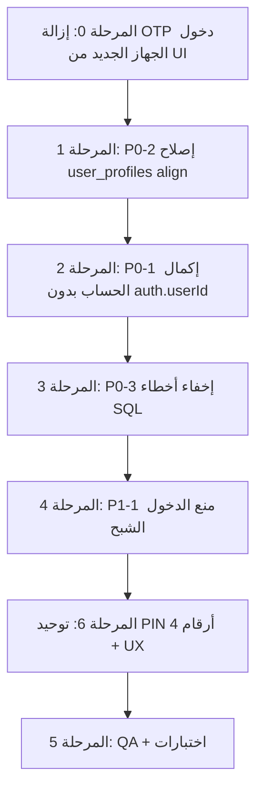

# خطة عمل الإصلاح — المصادقة والمزامنة
## Naboo ERP — يوليو 2026

**المرجع:** `docs/auth/SENSITIVE_ISSUES_AUDIT_REPORT.md`  
**الجمهور:** مبرمج + صاحب منتج  
**الحالة:** المراحل 0–4 و **6** مُنفَّذة — المتبقي: **QA على الجهاز** (المرحلة 5)  
**تقرير PIN:** `docs/auth/PIN_INPUT_UX_AUDIT_REPORT.md`  
**تقرير الجاهزية الاحترافية (S1–S12):** `docs/auth/PROFESSIONAL_GRADE_AUDIT_V1.md`  
**خطة معالجة S1–S12 (المرحلة 8):** `docs/auth/PROFESSIONAL_GRADE_FIX_PLAN_V1.md`

---

## 1. الهدف

إصلاح المشاكل الحرجة التي ظهرت في الاختبار على الجهاز (RMX5313) بحيث:
- يكتمل التسجيل/إكمال الحساب بدون «لا توجد جلسة نشطة»
- لا تظهر أخطاء SQLite خام للمستخدم
- لا يدخل المستخدم «شبحاً» بدون مزامنة سحابية صحيحة
- تُبسَّط شاشة الدخول (إزالة مسار OTP البريد للجهاز الجديد)
- **رمز PIN = 4 أرقام بالضبط** في كل شاشات الإدخال (لا حروف، لا 4–6)

---

## 2. ما تم طلبه صراحةً من صاحب المنتج

| # | الطلب | القرار |
|---|--------|--------|
| A | خطة عمل **قبل** تنفيذ إصلاحات P0 | هذا المستند |
| B | إزالة «الدخول برمز يُرسل إلى بريدك (جهاز جديد)» **بشكل تام** | المرحلة 0 — تنفيذ فوري |

**ملاحظة:** مسارات OTP الأخرى **تبقى** لأنها ضرورية:
- تسجيل حساب جديد (`EmailOtpScreen`)
- نسيت PIN / استعادة PIN (`OwnerPinRestoreOtpScreen`, `ForgotPasswordOtpScreen`)

---

## 3. ترتيب التنفيذ (المراحل)



---

## المرحلة 0 — إزالة OTP دخول «جهاز جديد» (≈ 30 دقيقة) ✅

**السبب:** المستخدم لا يريد هذا المسار؛ Google + PIN المحلي كافيان للمنتج الحالي.

| الملف | الإجراء |
|-------|---------|
| `lib/screens/login_screen.dart` | حذف زر «الدخول برمز…» + إزالة التوجيه التلقائي لـ `EmailLoginOtpScreen` |
| `lib/screens/auth/email_login_otp_screen.dart` | **حذف الملف** |
| `lib/providers/auth_provider.dart` | حذف `sendEmailLoginOtp`, `loginWithEmailOtp`, `loginRequiresOtpEmail`؛ تعديل `_loginViaSupabaseFallback` لرسالة عربية بدل إرسال OTP |

**رسالة بديلة على جهاز جديد:**
> «هذا جهاز جديد أو لا توجد بيانات حساب محفوظة. سجّل الدخول عبر Google أو أنشئ حساباً جديداً.»

**اختبار:**
- [ ] شاشة الدخول لا تعرض رابط OTP البريد
- [ ] فشل دخول PIN على جهاز فارغ → رسالة واضحة (لا فتح شاشة OTP)
- [ ] Google + تسجيل جديد + نسيت PIN — ما زالت تعمل

---

## المرحلة 1 — P0-2: إصلاح `_alignUserProfileIdForGlobalId` (4–8 ساعات) ✅

**تم:** استبدال `_alignUserProfileIdForGlobalId` بـ `_reconcileUserProfileAfterUserApply` + اختبارات في `test/security/user_profile_id_reconcile_test.dart`.

**المشكلة:** `UPDATE user_profiles SET id=? WHERE global_id=?` يصطدم بـ PRIMARY KEY عند وجود صف آخر بنفس `id`.

**الملف:** `lib/services/db_users.dart:177-194`

**الإصلاح المقترح:**
1. **لا تُحدّث** عمود `id` (PK) أبداً بعد الإنشاء
2. عند import من السحابة: دمج بالـ `global_id` فقط — إن وُجد `global_id` محلياً → `UPDATE` باقي الأعمدة؛ وإلا → `INSERT` بـ `id` جديد أو `id` من السحابة إن شاغر
3. إن تعارض `id` محلي مع `global_id` سحابي → **reconcile** عبر `users` table (ربط `global_id` ↔ `users.id`) بدل overwrite PK

**اختبارات مطلوبة:**
- [ ] unit test: profile موجود `id=1` + import cloud profile `global_id=X` لنفس المالك
- [ ] unit test: staff profile import على جهاز ثانٍ
- [ ] regression: `applyUserProfilesIntoUsersTransaction` كامل

**مخاطر:** متوسطة — يمس sync + employee gate

---

## المرحلة 2 — P0-1: إكمال الحساب بعد Google (≈ 1 ساعة) ✅

**تم:** `completeGoogleOwnerProfile` يستخدم `getLocalOwnerRow()` + فحص جلسة Supabase.

**المشكلة:** `completeGoogleOwnerProfile` يتحقق من `_userId` + `_isLoggedIn` بينما جلسة Google قد تكون نشطة دون `_isLoggedIn`.

**الملف:** `lib/providers/auth_provider.dart:2286-2288`

**الإصلاح:** نفس نمط `owner_pin_restore_otp_screen`:
- استخدم `getLocalOwnerRow()` / `localOwnerUserId` من arguments
- اسمح بالإكمال إذا Supabase session + صف owner محلي (أو يُنشأ أثناء finalize)

**اختبار:**
- [ ] Google جديد → إكمال جوال+PIN → `/home` بدون «لا جلسة»
- [ ] Google على جهاز فيه owner قديم → لا كسر

---

## المرحلة 3 — P0-3: إخفاء أخطاء SQLite (≈ 2 ساعة) ✅

**تم:** `humanizeCloudSyncError` يُخفي `DatabaseException` ويعرض رسالة عربية.

**المشكلة:** `humanizeCloudSyncError` يعيد `error.toString()` — يظهر `DatabaseException(UNIQUE…)` للمستخدم.

**الملفات:**
- `lib/services/cloud_sync_service.dart:71-84`
- `lib/screens/home_screen.dart:2016-2027`
- `lib/screens/auth/owner_pin_restore_otp_screen.dart:188-196`

**الإصلاح:**
- map لـ `DatabaseException`, `UNIQUE constraint`, `FOREIGN KEY`
- رسالة عربية: «تعذّر مزامنة البيانات. أغلِق التطبيق وأعد فتحه، أو تواصل مع الدعم.»
- log التفاصيل عبر `AppLogger` فقط

**اختبار:**
- [ ] أي فشل sync → لا SQL في SnackBar
- [ ] debug logs تحتوي التفاصيل

---

## المرحلة 4 — P1-1: منع الدخول «الشبح» (≈ 2 ساعة) ✅

**تم:** `_blockGhostLoginIfCloudDead` + توسيع فحص `supabaseUid` لجميع صيغ الدخول.

**المشكلة:** verify PIN محلي ينجح بينما السحابة/الحساب مُحذوف → home مع sync فاشل.

**الملف:** `lib/providers/auth_provider.dart` (مسار `login`)

**الإصلاح المقترح:**
- بعد verify PIN محلي: إن وُجد `supabaseUid` أو email سحابي → تحقق سريع من tenant/session
- إن فشل → امسح binding + رسالة «الحساب غير متاح. أنشئ حساباً جديداً أو سجّل عبر Google»

**اختبار:**
- [ ] حذف من admin-web → login PIN قديم → **لا** دخول
- [ ] حساب سليم offline → دخول محلي OK

---

## المرحلة 6 — توحيد PIN (4 أرقام) + إصلاح UX (≈ 3–4 ساعات) ✅

**السبب:** لقطات RMX5313 (23:04–23:07) — بعض الشاشات تسمح بحروف أو 5–6 أرقام، وحوار مصادقة المالك يفتح لوحة عربية كاملة، مع overflow في الإ onboarding وemployee gate.

**التقرير الكامل:** `docs/auth/PIN_INPUT_UX_AUDIT_REPORT.md`

| ID | الملف | الإجراء | الأولوية |
|----|-------|---------|----------|
| PIN-P0-1 | `lib/screens/users/user_form_screen.dart` | `LengthLimiting(4)` + `AuthValidators.isValidPin` + نص «4 أرقام» | **P0** |
| PIN-P0-2 | `lib/screens/onboarding/business_setup_wizard_screen.dart` | حد 4 + `isValidPin` عند الحفظ | **P0** |
| PIN-P0-3 | `lib/screens/auth/employee_pin_gate_screen.dart` | حوار «مصادقة المالك»: numpad أو `digitsOnly`+4 | **P0** |
| PIN-P1-1 | `business_setup_wizard_screen.dart` | `SingleChildScrollView` — إزالة BOTTOM OVERFLOW | P1 |
| PIN-P1-2 | `employee_pin_gate_screen.dart` | `Expanded` + `ellipsis` للاسم الطويل | P1 |
| PIN-P1-3 | `employee_pin_gate_screen.dart` + `open_shift_screen.dart` | «رمز PIN» بدل «كلمة مرور» حيث المقصود PIN | P1 | ✅ |
| PIN-P2-1 | `lib/utils/pin_input_constraints.dart` (جديد) | ثابت `formatters` + `validateField` مشترك | P2 |

**اختبار على الجهاز (RMX5313):**
- [ ] إنشاء كاشير (onboarding): لا overflow + لا أكثر من 4 أرقام
- [ ] مستخدم جديد: رفض 5–6 أرقام + رفض حروف
- [ ] «إضافة مستخدم» من employee gate: لوحة أرقام فقط
- [ ] اسم طويل في employee gate: لا RIGHT OVERFLOW
- [ ] login + signup — ما زالا 4 أرقام (regression)

---

## المرحلة 5 — QA نهائي (≈ 2–3 ساعات)

### مصادقة
- [ ] Google → إكمال حساب → home
- [ ] email signup → OTP → home
- [ ] نسيت PIN → OTP → home
- [ ] جهاز جديد → Google (لا OTP دخول بريد)

### مزامنة
- [ ] sync من الرئيسية — رسالة عربية عند الفشل
- [ ] جهاز ثانٍ import — بدون UNIQUE error

### RTL + أجهزة
- [ ] RMX5313 Android
- [ ] iPhone simulator (Google OAuth)

### أوامر
```bash
flutter analyze lib/providers/auth_provider.dart lib/services/db_users.dart lib/screens/login_screen.dart
flutter test test/auth/ test/suites/security/auth_security_test.dart
```

---

## 4. جدول الأولويات المحدّث

| # | المرحلة | الأولوية | الجهد | يعتمد على |
|---|---------|----------|-------|-----------|
| 0 | إزالة OTP دخول جهاز جديد | **فوري** (طلب المستخدم) | 30m | — |
| 1 | P0-2 user_profiles | **P0** | 4–8h | — |
| 2 | P0-1 complete profile | **P0** | 1h | — |
| 3 | P0-3 humanize errors | **P0** | 2h | — |
| 4 | P1-1 ghost login | **P1** | 2h | 1 (يفضل) |
| 6 | توحيد PIN + UX | **P0** | 3–4h | — |
| 5 | QA | — | 2–3h | 0–4 + **6** |

**المرحلة التالية (7):** سياسة الدخول البسيطة (Google مباشر + انتقال تلقائي بين التبويبين + إلغاء hydrate المزدوج) — راجع `docs/auth/AUTH_SIMPLE_POLICY_PLAN_V1.md`.

**اختياري لاحقاً (P2/P3):**
- زر «إعادة ضبط المصادقة» في شاشة الدخول
- bootstrap silent fail → SnackBar
- اختبارات تكامل multi-device

---

## 5. ما **لا** يُغيَّر في هذه الخطة

- مسار Google OAuth (بعد إصلاحات dart-define)
- OTP التسجيل وOTP استعادة PIN
- RLS / tenant isolation
- admin-web حذف الحساب

---

## 6. نقطة البدء للمبرمج

1. ✅ اقرأ `SENSITIVE_ISSUES_AUDIT_REPORT.md`
2. ✅ نفّذ **المرحلة 0** (إزالة OTP دخول الجهاز الجديد)
3. ⏭️ **المرحلة 1** (P0-2) — الأهم تقنياً؛ يفك معظم أخطاء sync
4. ⏭️ المراحل 2–3 بالتوازي إن أمكن
5. ⏭️ **المرحلة 6** — PIN 4 أرقام (راجع `PIN_INPUT_UX_AUDIT_REPORT.md`)
6. ⏭️ QA المرحلة 5 قبل أي release

---

*آخر تحديث: 4 يوليو 2026 — أُضيفت المرحلة 6 (PIN UX) من لقطات RMX5313*
