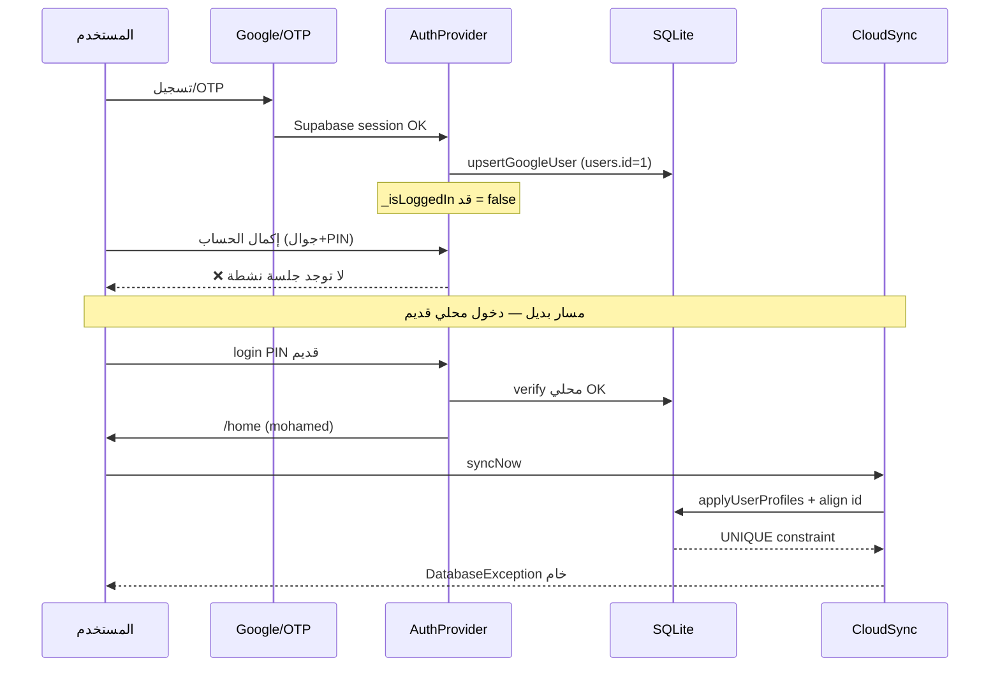

# تقرير فحص المشاكل الحساسة — Naboo ERP
## معادل تطبيق بقيمة سوقية ~$20,000

**التاريخ:** 4 يوليو 2026  
**المنصة:** Flutter + SQLite + Supabase  
**الجهاز المُختبر:** RMX5313 (Android 15) + iPhone Simulator  
**الجمهور:** مبرمج/مراجع تقني + صاحب منتج

---

## فهرس المحتويات

1. [الملخص التنفيذي](#1-الملخص-التنفيذي)
2. [خريطة المشاكل حسب الصور](#2-خريطة-المشاكل-حسب-الصور)
3. [المشاكل الحرجة P0](#3-المشاكل-الحرجة-p0)
4. [المشاكل العالية P1](#4-المشاكل-العالية-p1)
5. [المشاكل المتوسطة P2](#5-المشاكل-المتوسطة-p2)
6. [تحسينات P3](#6-تحسينات-p3)
7. [مشاكل تعمل «بصمت»](#7-مشاكل-تعمل-بصمت)
8. [سلسلة الأحداث — لماذا وصل المستخدم للوحة الرئيسية مع فشل خفي](#8-سلسلة-الأحداث)
9. [جدول الأولويات والإصلاح](#9-جدول-الأولويات-والإصلاح)
10. [قائمة فحص QA للمبرمج](#10-قائمة-فحص-qa)
11. [مشاكل PIN — لقطات RMX5313 (4 يوليو)](#11-مشاكل-pin--لقطات-rmx5313-4-يوليو)

---

## 1. الملخص التنفيذي

التطبيق **يعمل ظاهرياً** (يصل للوحة الرئيسية، يعرض «مرحباً mohamed») لكن **طبقة المصادقة والمزامنة تحتوي عيوباً حرجة** تظهر عند:
- إكمال الحساب بعد Google/OTP
- استعادة PIN عبر OTP
- أي مزامنة سحابية تلمس `user_profiles`

| المستوى | العدد | التأثير على المستخدم |
|---------|-------|---------------------|
| **P0 حرج** | 4 + **3 PIN** | يمنع إكمال التسجيل / يكسر المزامنة / **PIN غير موحّد** |
| **P1 عالي** | 5 + **4 PIN** | دخول «شبح»، **overflow UI**، مصطلحات «كلمة مرور» |
| **P2 متوسط** | 4 | حالات edge بعد حذف حساب، رسائل غير واضحة |
| **P3 تحسين** | 3 | UX، أمان عرض الأخطاء، أدوات دعم |

**الخلاصة لصاحب المنتج:** المشكلة ليست «شاشة دخول واحدة» — بل **تعارض بين هوية محلية (`users.id`) وهوية سحابية (`global_id`)** في جدول `user_profiles`، م compounded بفحص جلسة خاطئ في شاشة «إكمال الحساب»، **إضافةً إلى عدم توحيد قيود PIN (4 أرقام) عبر شاشات الإعداد وإدارة المستخدمين** (تفاصيل: [§11](#11-مشاكل-pin--لقطات-rmx5313-4-يوليو)).

---

## 2. خريطة المشاكل حسب الصور

### صورة 1 — «إكمال الحساب» + «لا توجد جلسة نشطة»

```
المستخدم يملأ: جوال 07801143073 + PIN
        ↓
completeGoogleOwnerProfile()
        ↓
if (_userId == null || !_isLoggedIn)  ← فشل هنا
        ↓
«لا توجد جلسة نشطة. أعد تسجيل الدخول.»
```

**الملف:** `lib/providers/auth_provider.dart:2286-2288`  
**الشاشة:** `lib/screens/auth/complete_owner_profile_screen.dart:122`

---

### صورة 2 — لوحة الرئيسية + خطأ مزامنة

```
المستخدم داخل التطبيق (mohamed)
        ↓
syncNow() أو مزامنة تلقائية
        ↓
applyUserProfilesIntoUsersTransaction()
        ↓
_alignUserProfileIdForGlobalId()  ← crash SQLite
        ↓
SnackBar: «تعذّر التزامن: DatabaseException(UNIQUE constraint...)»
```

**الملف:** `lib/services/db_users.dart:177-194`  
**العرض:** `lib/screens/home_screen.dart:2023`

---

### صورة 3 — «التحقق من الهوية» OTP + نفس خطأ SQLite

```
OTP صحيح (64643684)
        ↓
verifyOwnerPinRestoreOtpAndApply()
        ↓
_completeCloudBootstrapAfterRestore() → syncNowDetailed()
        ↓
import cloud snapshot → applyUserProfilesIntoUsersTransaction()
        ↓
_alignUserProfileIdForGlobalId SET id=1 WHERE global_id=e755dfda-...
        ↓
UNIQUE constraint failed: user_profiles.id
        ↓
الخطأ التقني يُعرض للمستخدم حرفياً على الشاشة
```

**الملفات:**  
- `lib/services/db_users.dart:335-339`  
- `lib/screens/auth/owner_pin_restore_otp_screen.dart:188-196`

---

## 3. المشاكل الحرجة P0

---

### P0-1 — شاشة «إكمال الحساب» تتطلب `auth.userId` غير موجود

| | |
|--|--|
| **الخطورة** | 🔴 حرج |
| **الحالة** | مفتوح — **لم يُصلح** (بخلاف `owner_pin_restore_otp` الذي أُصلح جزئياً) |
| **الملف** | `auth_provider.dart:2286-2288` |

**الكود:**

```dart
final localId = _userId;
if (localId == null || !_isLoggedIn) {
  return 'لا توجد جلسة نشطة. أعد تسجيل الدخول.';
}
```

**لماذا يحدث:**
- بعد Google OAuth أو OTP، Supabase session **موجودة**
- لكن `lockSession()` أو مسار splash قد يكون مسح `local_auth_user_id`
- `_finalizeGoogleOAuthSession` ينشئ صف SQLite لكن `_isLoggedIn` قد = false عند فتح الشاشة

**التأثير:** المستخدم **لا يستطيع إكمال التسجيل** رغم أن OTP/Google نجحا.

**الإصلاح المقترح:**
```dart
final row = await getLocalOwnerRow();
final localId = row?['id'] as int? ?? _userId;
if (localId == null) return '...';
// لا تشترط _isLoggedIn إذا Supabase session + owner row موجود
```

---

### P0-2 — `_alignUserProfileIdForGlobalId` يكسر PRIMARY KEY

| | |
|--|--|
| **الخطورة** | 🔴 حرج |
| **الحالة** | مفتوح |
| **الملف** | `db_users.dart:177-194` |

**الكود المسبب:**

```dart
await txn.update(
  'user_profiles',
  {'id': userId},
  where: 'global_id = ?',
  whereArgs: [globalId],
);
```

**السيناريو:**
1. جهاز A: owner `users.id=1`, profile `global_id=AAA`
2. بعد حذف/إعادة تسجيل/استيراد سحابي: profile جديد `global_id=BBB` لكن `id=2`
3. `users.id=1` مربوط بـ `global_id=BBB`
4. UPDATE يحاول `SET id=1` على صف BBB بينما `id=1` **محجوز** لصف AAA → **UNIQUE constraint**

**يظهر في:**
- OTP استعادة PIN (صورة 3)
- زر المزامنة في الرئيسية (صورة 2)
- أي `reconcileUserDirectoryAfterCloudImport`

**الإصلاح المقترح:**
- **لا تُحدّث `id` (PK)** — `id` محلي فقط، `global_id` هو المفتاح السحابي
- أو: merge/delete الصف المتعارض قبل UPDATE
- أو: استخدام `_mergeUserProfilesByGlobalId` بدل UPDATE مباشر

---

### P0-3 — عرض `DatabaseException` خام للمستخدم

| | |
|--|--|
| **الخطورة** | 🔴 حرج (UX + أمن) |
| **الملف** | `cloud_sync_service.dart:71-84`, `home_screen.dart:2018-2023`, `owner_pin_restore_otp_screen.dart` |

**`humanizeCloudSyncError`:**

```dart
return error.toString();  // ← يمرّر SQL كاملاً للواجهة
```

**المشاكل:**
- المستخدم يرى: `UPDATE user_profiles SET id = ? WHERE global_id = ?`
- يكشف schema الداخلية
- لا يوجه لحل (مسح بيانات / دعم)

**الإصلاح:** تصنيف `SQLITE_CONSTRAINT` → «تعارض في بيانات الموظفين — تواصل مع الدعم أو أعد ضبط الجهاز»

---

### P0-4 — حالة الجهاز بعد حذف حساب من admin-web

| | |
|--|--|
| **الخطورة** | 🔴 حرج |
| **التوثيق** | `docs/auth/DELETE_RELOGIN_DIAGNOSIS.md` |
| **الحالة** | جزئياً مُصلح في الكود، **يتطلب مسح بيانات** على أجهزة قديمة |

**ما يبقى على الجهاز بعد حذف السحابة:**
- SQLite: `users` + PIN قديم + `supabaseUid` محذوف
- Secure Storage: كلمة Supabase الداخلية
- `device_owner_bound` + UUID قديم

**التأثير:** لا يعمل **أي** حساب قديم على نفس الجهاز بدون مسح بيانات.

---

## 4. المشاكل العالية P1

---

### P1-1 — دخول «شبح» للوحة الرئيسية مع مزامنة مكسورة

**الملاحظة من صورة 2:** المستخدم «mohamed» داخل التطبيق، أيقونة السحابة حمراء.

**السبب:**
- `login()` ينجح **محلياً** ب PIN قديم
- `_tryEnableCloudSessionAfterLocalLogin` **لا يفشل** الدخول إن فشلت السحابة
- المستخدم يظن أنه «داخل» لكن المزامنة فاشلة

**الملف:** `auth_provider.dart:843-851`, `_ensureSupabaseSessionForLocalCloudAccount:1199-1214`

---

### P1-2 — `completeGoogleOwnerProfile` vs `owner_pin_restore` — عدم اتساق

| الشاشة | آلية resolve local id | الحالة |
|--------|----------------------|--------|
| `owner_pin_restore_otp` | `getLocalOwnerRow()` | ✅ أُصلح |
| `complete_owner_profile` | `_userId` + `_isLoggedIn` | ❌ لا يزال معطوب |

---

### P1-3 — `GOOGLE_WEB_CLIENT_ID` غير مضبوط في بعض builds

**اللوغ:** `GOOGLE_WEB_CLIENT_ID not set — falling back to browser OAuth`

**التأثير:**
- fallback Safari → PKCE fragile
- crash `Code verifier could not be found` (أُصلح جزئياً في main.dart)

**الإصلاح:** `dart.flutterAdditionalArgs` في `.vscode/settings.json` (تم)

---

### P1-4 — bootstrap يفشل بصمت أحياناً

**`_completeCloudBootstrapAfterRestore` catch:**

```dart
} catch (e) {
  if (_pendingCloudWorkspaceRestore) {
    return 'تعذّر استرجاع بيانات النشاط...';
  }
  return null;  // ← يبلع الخطأ إن لم يكن mandatory!
}
```

**التأثير:** مزامنة فاشلة **بدون رسالة** في مسارات غير mandatory.

---

### P1-5 — `_upsertUserProfileByUserId` يستخدم `id` كـ PK مشترك

**الملف:** `db_users.dart:516-535`

```dart
await db.insert('user_profiles', {
  'id': id,  // نفس users.id — يفترض 1:1 دائماً
  'global_id': globalId,
  ...
}, conflictAlgorithm: ConflictAlgorithm.replace);
```

**المشكلة:** بعد multi-device sync، `user_profiles.id` من السحابة ≠ `users.id` محلياً → سلسلة أخطاء لاحقة.

---

## 5. المشاكل المتوسطة P2

---

### P2-1 — رسائل auth غير موحّدة

| الرسالة | متى | واضحة؟ |
|---------|-----|--------|
| «لا توجد جلسة نشطة» | complete profile | ❌ تقنية |
| «تعذر تحديد حساب المالك» | pin restore | ✅ أفضل |
| «DatabaseException...» | sync/OTP | ❌ للمبرمج فقط |

---

### P2-2 — لا يوجد «إعادة ضبط الجهاز» في UI

المستخدم العالق بعد حذف حسابات **لا يجد زراً** — يحتاج مسح بيانات يدوياً.

---

### P2-3 — `verifyOwnerConfirmationCredential` يجرّب PIN كـ Supabase password

**الملف:** `auth_provider.dart:2765-2767`

PIN 4 أرقام ≠ كلمة سر Supabase — fallback **لن يعمل** لحسابات email.

---

### P2-4 — Android Gradle على MacBook Air 8GB

- `-Xmx8G` (قديم) → swap → build 20+ دقيقة
- **تم** تخفيض إلى 3GB في `gradle.properties`

---

## 6. تحسينات P3

1. **زر «إعادة ضبط المصادقة»** في شاشة الدخول (يمسح SQLite auth + secure storage + device binding)
2. **تقرير تشخيص** داخل التطبيق للدعم (prefs + sync state بدون PII)
3. **اختبارات تكامل** لـ `_alignUserProfileIdForGlobalId` مع سيناريو multi-device

---

## 7. مشاكل تعمل «بصمت»

| # | المشكلة | لماذا صامتة | كيف تكتشفها |
|---|---------|-------------|-------------|
| S1 | جلسة Supabase ghost بعد logout | `restoreSession` لا يمسح إن `deviceOwnerBound` | فحص prefs |
| S2 | `owner_auth_secrets` فارغ لكن `auth.users` موجود | login OTP يفشل بـ «لا حساب مكتمل» | Supabase dashboard |
| S3 | مزامنة فاشلة non-mandatory | bootstrap يرجع `null` | لا SnackBar |
| S4 | `OwnerSupabaseCredentialStore` قديم | fallback يحاول signIn ثم OTP | logs |
| S5 | staff shadow users | `pruneCloudStaffShadowUsers` | employee gate فارغ |
| S6 | tenant context خاطئ بعد account switch | KPIs صفر | owner dashboard |
| S7 | RPC `app_upsert_owner_auth_secret` missing | push PIN للسحابة يفشل silently | cloud empty secrets |

---

## 8. سلسلة الأحداث



---

## 9. جدول الأولويات والإصلاح

| الأولوية | المشكلة | الملف | الجهد | المخاطر |
|----------|---------|-------|-------|---------|
| **1** | P0-2 align profile id | `db_users.dart` | 4-8h | متوسط — يحتاج tests |
| **2** | P0-1 complete profile session | `auth_provider.dart` | 1h | منخفض |
| **3** | P0-3 humanize SQL errors | `cloud_sync_service.dart` | 2h | منخفض |
| **4** | P1-1 orphan local login block | `auth_provider.dart` | 2h | منخفض |
| **5** | P0-4 reset device UI | login screen | 4h | منخفض |
| **6** | **PIN UX (4 أرقام)** | `user_form`, `business_setup_wizard`, `employee_pin_gate` | 3-4h | منخفض |
| **7** | P1-4 bootstrap silent fail | `auth_provider.dart` | 1h | منخفض |

> P0-1 إلى P0-3 و P1-1 **مُنفَّذة** — راجع `REMEDIATION_WORK_PLAN.md`. **PIN (6) مطلوب قبل QA.**

---

## 10. قائمة فحص QA

### مصادقة
- [ ] Google → إكمال حساب → PIN → home (بدون «لا جلسة»)
- [ ] OTP استعادة PIN → home (بدون DatabaseException)
- [ ] حذف admin-web → مسح بيانات → تسجيل جديد بنفس البريد
- [ ] login PIN بعد حذف حساب → **لا** دخول شبح

### مزامنة
- [ ] sync من الرئيسية → رسالة عربية (ليس SQL)
- [ ] جهاز ثانٍ → import staff profiles → employee gate
- [ ] owner + 2 staff → sync push/pull بدون UNIQUE error

### عرض الأخطاء
- [ ] أي فشل sync → **لا** يظهر `DatabaseException` أو `UPDATE user_profiles`
- [ ] أي فشل auth → رسالة عربية + إجراء مقترح

### PIN (4 أرقام)
- [ ] onboarding كاشير: حد 4 + لا overflow مع لوحة المفاتيح
- [ ] مستخدم جديد: رفض 5–6 أرقام والحروف
- [ ] حوار مصادقة المالك: أرقام فقط
- [ ] employee gate: اسم طويل بدون overflow
- [ ] login/signup: regression — ما زال 4 أرقام

---

## 11. مشاكل PIN — لقطات RMX5313 (4 يوليو)

> **تقرير مفصّل:** `docs/auth/PIN_INPUT_UX_AUDIT_REPORT.md`  
> **خطة التنفيذ:** `REMEDIATION_WORK_PLAN.md` — المرحلة 6

**السياسة:** `AuthValidators.isValidPin` = `^\d{4}$` — أربعة أرقام بالضبط.

### ملخص سريع حسب الصورة

| # | الشاشة | المشكلة الرئيسية | P |
|---|--------|------------------|---|
| 1 | إعداد سريع — إنشاء الكاشير | overflow + PIN بدون حد 4 | P0/P1 |
| 2 | حوار مصادقة المالك | لوحة عربية كاملة + «كلمة مرور» | **P0** |
| 3 | مستخدم جديد | نص «4-6» + `maxLength(6)` + تحقق ≥4 فقط | **P0** |
| 4 | employee gate — لوحة PIN | overflow اسم طويل + «كلمة مرور» | P1 |
| 5 | تسجيل الدخول | **OK في الكود** | — |
| 6 | إنشاء حساب | **OK في الكود** | — |

### P0-PIN — يجب إصلاحها قبل الإ release

| ID | الوصف | الملف |
|----|--------|-------|
| PIN-P0-1 | `user_form_screen`: 4–6 → 4 + `isValidPin` | `lib/screens/users/user_form_screen.dart` |
| PIN-P0-2 | `business_setup_wizard`: حد 4 + تحقق عند الحفظ | `lib/screens/onboarding/business_setup_wizard_screen.dart` |
| PIN-P0-3 | حوار `_onAddUserTap`: أرقام فقط (numpad أو formatters) | `lib/screens/auth/employee_pin_gate_screen.dart` |

### P1-PIN — UX ومصطلحات

| ID | الوصف |
|----|--------|
| PIN-P1-1 | `SingleChildScrollView` في خطوة الكاشير (BOTTOM OVERFLOW 21px) |
| PIN-P1-2 | `Expanded` + `ellipsis` لاسم المستخدم (RIGHT OVERFLOW 148px) |
| PIN-P1-3 | استبدال «كلمة مرور» بـ «رمز PIN» حيث المقصود PIN المحلي |

---

## ملحق — مراجع الكود

| الموضوع | الملف:سطر |
|---------|----------|
| complete profile session check | `auth_provider.dart:2286-2288` |
| align profile id bug | `db_users.dart:177-194` |
| apply profiles transaction | `db_users.dart:198-340` |
| cloud merge by global_id | `cloud_sync_service.dart:3748-3818` |
| sync error display | `home_screen.dart:2016-2027` |
| humanize errors | `cloud_sync_service.dart:71-84` |
| delete+relogin diagnosis | `docs/auth/DELETE_RELOGIN_DIAGNOSIS.md` |
| full auth audit | `docs/auth/AUTH_FLOW_AUDIT_REPORT.md` |
| PIN UX audit (6 screenshots) | `docs/auth/PIN_INPUT_UX_AUDIT_REPORT.md` |
| isValidPin canonical | `lib/utils/auth_validators.dart:4-9` |

---

*تقرير مراجعة تقنية — جاهز للمبرمج المكلف بالإصلاح.*
