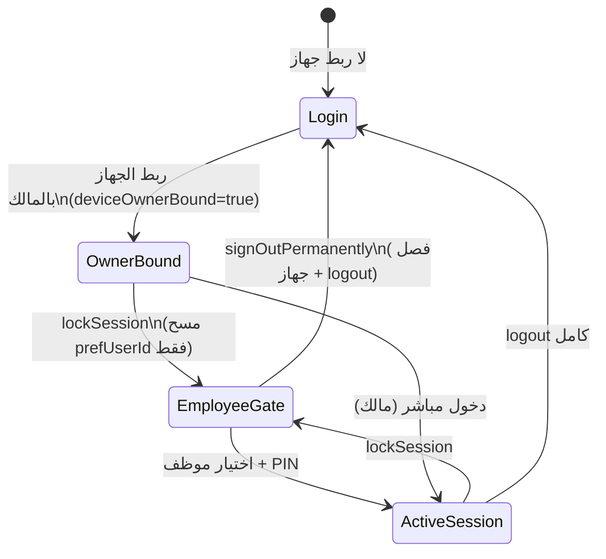
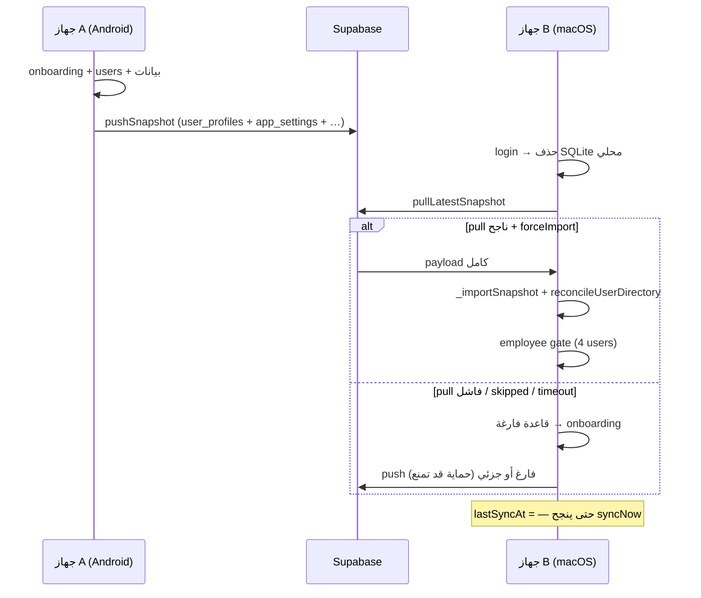

# تدقيق شامل: المزامنة، الدخول/الخروج، والأجهزة المربوطة

**التاريخ:** 2026-06-02  
**النطاق:** حساب سحابي واحد على جهازين (macOS + Android) — نفس البريد `mohamed.albaqer.m@gmail.com`  
**المرجع البصري:** لقطات 20:34 — بوابة «من سيبدأ العمل؟» وقائمة حساب الاشتراك  
**الحالة:** تحليل معماري + ثغرات + فجوات — **ليس خطة تنفيذ مُعتمدة بعد**

---

## 1. ملخص تنفيذي

التطبيق يعمل **offline-first** مع SQLite محلي، ويربط الحساب السحابي عبر **Supabase Auth**. المزامنة بين الأجهزة تعتمد أساساً على:

1. **لقطة كاملة (Snapshot)** → جدول `app_snapshots` (+ أجزاء `app_snapshot_chunks`)
2. **طابور محلي (sync_queue)** → RPC `rpc_process_sync_queue` (لكيانات محددة)
3. **Realtime** → إشعارات على `app_snapshots` و`account_devices`

**ما يظهر في لقطاتك ليس «خللاً عشوائياً»** — بل نتيجة متوقعة لعدة تصميمات متداخلة:

| الظاهرة في اللقطات | السبب المعماري المحتمل |
|--------------------|-------------------------|
| macOS: مستخدمان فقط (baqer + baqer mohamed)؛ Android: أربعة (b, baqer, baqer1, baqer mohamed) | لقطة لم تُستورد كاملة على mac، أو `user_profiles` لم تُدمَج في `users`، أو push من mac رفع نسخة أقدم/أضعف |
| macOS: مبيعات/صندوق = 0؛ Android: بيانات كاملة | mac لم يسحب اللقطة بعد، أو سحب فاشل/متأخر، أو push محلي فارغ تُوقف (حماية) لكن الواجهة بقيت فارغة |
| macOS: «آخر مزامنة —»؛ Android: «الآن» | `lastSyncAt` لم يُحدَّث على mac بعد pull/push ناجح |
| macOS: تجربة 2026/06/02–17 (15 يوم)؛ Android: 2026/06/01–16 (14 يوم) | مسار **تجربة محلية** (`lic.local_trial_start_at`) vs **تجربة سحابية** (`profiles.trial_started_at`) — جهازان لم يُوحَّدا |
| «الأجهزة المرتبطة 2/1» | جهازان `active` في `account_devices` بينما حد الخطة = 1 (أو JWT يعيد 0 و`effectiveMaxDevices` ي fallback إلى 2) — عدّاد وعرض غير متسق |

---

## 2. نموذج الجلسة (كيف يفهم التطبيق «من دخل؟»)



### طبقات الهوية (مهم للتدقيق)

| الطبقة | التخزين | المعنى |
|--------|---------|--------|
| **جلسة Supabase** | Keychain / SharedPreferences fallback | JWT سحابي — من يملك الحساب على السيرفر |
| **ربط الجهاز بالمالك** | `auth.device_owner_bound` + `auth.device_owner_supabase_uid` | هذا الجهاز «مُفعَّل» لنشاط تجاري مربوط بـ UUID المالك |
| **جلسة تشغيل محلية** | `local_auth_user_id` | من يعمل الآن (مالك/موظف) — PIN gate |
| **نطاق البيانات** | `auth.active_data_owner` = `cloud:<uid>` | أي ملف SQLite «ينتمي» لهذا الحساب |
| **TenantContext (String)** | ذاكرة — UUID سحابي | بوابة Supabase/RLS و بعض DAOs |
| **TenantContextService (int)** | `app_settings` + جدول `tenants` | `tenantId` في SQLite |

**ثغرة تصميم:** طبقتان للمستأجر (String vs int). بعد `lockSession()` أو إعادة التشغيل قد يُمسح UUID بينما int tenant يبقى — أو العكس — فيفشل guard أو استعلام (مثل فحص الوردية عند الخروج).

---

## 3. مسارات الدخول والخروج (تفصيلي)

### 3.1 إنشاء حساب (OTP / Google)

```
sendRegistrationOtp → signUp
verifyOtpAndRegister → verifyOTP (signup ثم email)
  → upsertGoogleUser(asDeviceOwner: true)
  → ensureLocalTrialStarted()          ← تجربة محلية أولاً
  → _completeCloudBootstrapAfterRestore
       → bootstrapForSignedInUser
       → applyTrialFromSupabaseProfile  ← تجربة سحابية (إن نجح)
       → enforcePlanDeviceLimit
       → syncNow(pull + importOnPull)
```

**ملفات:** `auth_provider.dart` — `verifyOtpAndRegister`, `_completeCloudBootstrapAfterRestore`  
**Google:** يستدعي `_bindDeviceToOwner` صراحة.  
**OTP:** **لا** يستدعي `_bindDeviceToOwner` — يعتمد على `upsertGoogleUser` للدور فقط؛ prefs `deviceOwnerBound` قد تتأخر.

### 3.2 تسجيل الدخول (جهاز ثانٍ)

```
login(email, password)
  → _loginViaSupabaseFallback (إن لم يوجد محلي)
       → _bindAccountDataScope('cloud:uid')
            → إن previous != cloud:uid: حذف ملف SQLite بالكامل!
       → upsertGoogleUser + _bindDeviceToOwner
       → _completeCloudBootstrapAfterRestore → syncNow
  → resolveRouteAfterAuthenticatedSession (بعد إصلاح 2026-06-02)
       → hydrateCloudAccountData(forceImportOnPull: true)
       → /onboarding | /home | /open-shift
```

**نقطة حرجة:** `_bindAccountDataScope` على جهاز جديد **يمسح القاعدة** ثم يتوقع استردادها من السحابة. أي فشل pull = جهاز «فارغ» + onboarding.

### 3.3 lockSession (قفل → بوابة الموظفين)

- يمسح `local_auth_user_id` فقط
- **يبقي** Supabase + `deviceOwnerBound`
- يعيد ضبط `TenantContext` من `device_owner_supabase_uid` (بعد إصلاح 2026-06-02)

**ملف:** `auth_provider.dart` — `lockSession`

### 3.4 logout / signOutPermanentlyFromDevice

| الخطوة | logout | signOutPermanently |
|--------|--------|---------------------|
| فحص sync_queue (pending/failed/dead) | نعم | نعم (+ bypass طارئ) |
| فحص وردية مفتوحة | نعم | نعم (+ bypass مالك) |
| Supabase signOut | نعم | بعد revoke جهاز |
| `stopForSignOut` | نعم | نعم |
| `clearDeviceOwnerBinding` | لا | نعم |
| مسح TenantContext | نعم | نعم |

**ملفات:** `auth_provider.dart`, `employee_pin_gate_screen.dart`, `sync_queue_service.dart`

---

## 4. آلية المزامنة — ثلاث مسارات

### 4.1 اللقطة (Snapshot) — **المسار الرئيسي بين الأجهزة**

**الرفع (`_pushSnapshot`):**
- يجمع **كل** جداول SQLite المؤهلة (ليس delta جزئي — إصلاح سابق لمنع جداول ناقصة)
- **يستثني:** `users`, `sync_queue`, `product_warehouse_stock`, sqlite internals
- **المستخدمون:** عبر جدول `user_profiles` (hash/salt PIN + `global_id`) — **ليس** جدول `users` مباشرة

**السحب (`_pullLatestSnapshot` → `_importSnapshot`):**
- LWW على `updatedAt` / `deleted_at`
- بعد الاستيراد: `reconcileUserDirectoryAfterCloudImport()`

**حماية من الكارثة:**
```text
إن كانت القاعدة المحلية فارغة AND السحابة فيها بيانات
  → يُمنع الرفع (lastError عربي)
```

**ملف:** `cloud_sync_service.dart` — `_pushSnapshot`, `_pullLatestSnapshot`, `_importSnapshot`

### 4.2 sync_queue — **محلي لكل جهاز**

| خاصية | القيمة |
|-------|--------|
| التخزين | SQLite `sync_queue` |
| الكيانات | expense, customer, work_shift, cash_ledger, supplier, product_variant, service_order, … |
| المعالجة | RPC `rpc_process_sync_queue` كل ~30 ث |
| في اللقطة؟ | **لا** — الجهاز B لا يرى queue جهاز A |

**يعمل جيداً لـ:** عمليات تدريجية بعد حفظ محلي (مصروف، عميل، …)  
**لا يُعتمد عليه لـ:** نقل إعدادات أولية أو دليل مستخدمين كامل

### 4.3 User Directory Push

```
تعديل users محلياً
  → _upsertUserProfileByUserId (نسخ إلى user_profiles)
  → scheduleUserDirectoryPushSoon (250ms debounce)
  → syncNow(forcePull: false, forcePush: true)  ← push فقط عمداً
```

**السبب:** pull بعد تعديل محلي قد يعيد دمجاً خاطئاً بـ `id` محلي مختلف بين الأجهزة.

**ملفات:** `db_users.dart`, `cloud_sync_service.dart`

---

## 5. بوابة «من سيبدأ العمل؟» — لماذا قوائم مختلفة؟

### 5.1 مصدر القائمة

```dart
listActiveUsersForEmployeeGate()
  → owner/admin: دائماً
  → staff: فقط إن passwordHash + passwordSalt محلياً غير فارغين
```

**ملف:** `db_users.dart:589`

### 5.2 بعد استيراد السحابة

```
remoteImportGeneration++ 
  → employee_pin_gate يستمع
  → reconcileUserDirectoryAfterCloudImport()
       → applyUserProfilesIntoUsersTransaction (user_profiles → users)
       → pruneCloudStaffShadowUsers
       → تعطيل staff بلا PIN في user_profiles
```

### 5.3 تفسير لقطتك (4 vs 2 مستخدم)

| المستخدم | Android | macOS | تفسير |
|----------|---------|-------|--------|
| baqer mohamed (owner) | ✓ | ✓ | owner دائماً يظهر |
| baqer | ✓ | ✓ | PIN مدمج من user_profiles |
| baqer1 | ✓ | ✗ | أُنشئ/دُفع من Android؛ mac لم يستورد user_profiles أو reconcile فشل |
| b | ✓ | ✗ | نفس السبب — أو staff بلا salt/hash على mac |

**سينarios محتملة:**
1. mac سجّل دخول **قبل** push كامل من Android  
2. mac pull نجح لكن **push-only** من hydrate أعاد نسخة أضعف  
3. mac أنشأ onboarding محلي (baqer فقط) ثم لم يُستبدَل بالسحابة  
4. `hydrateCloudAccountData` timeout — الواجهة تكمل بقاعدة ناقصة  

---

## 6. الأجهزة المربوطة — التسجيل والعرض والفصل

### 6.1 التسجيل

```
bootstrapForSignedInUser / syncNow
  → registerCurrentDevice()
       → RPC app_register_device (أولاً)
       → fallback: upsert account_devices
```

**جدول:** `account_devices` — `user_id`, `device_id`, `access_status` (active/revoked), `device_label`

### 6.2 حد الأجهزة

| الطبقة | السلوك |
|--------|--------|
| JWT `max_devices` | من `LicenseService` |
| `effectiveMaxDevices` | إن JWT=0 → fallback `plan.maxDevices` (trial/basic=2) |
| RPC `app_device_limit_status` | overlay كل 5 دقائق |
| `enforcePlanDeviceLimit` | عند login bootstrap |
| `syncNow` | يرفض إن `DEVICE_LIMIT_REACHED` |

**عرض UI:** `owner_account_profile_menu.dart` — `activeDevices / effectiveMaxDevices`

### 6.3 مشكلة «2/1» في لقطتك

- **2 active:** macOS + Android مسجّلان في `account_devices`
- **/1:** قد يعني JWT أعاد `max_devices=1` بينما `effectiveMaxDevices` كان 2 سابقاً، أو العكس
- **bootstrap يبتلع** `DeviceLimitReachedException` ويعود `true` — الدخول يكمل ثم limit يظهر لاحقاً في sync

### 6.4 الفصل (revoke)

| الإجراء | API | النتيجة |
|---------|-----|---------|
| خروج نهائي من البوابة | `signOutAndRevokeCurrentDevice` | push ثم `access_status=revoked` |
| إزالة جهاز من الإعدادات | `removeDevice(deviceId)` | revoke جهاز آخر |
| موافقة جهاز مُفصول | `approveDeviceAccess` | active مرة أخرى |
| Realtime kick | channel `account_devices` | `logout()` كامل |

**ثغرات UX:**
- قائمة الأجهزة في popup محدودة (~3 أسماء) — الباقي في الإعدادات فقط
- فصل جهاز **لا** يمسح SQLite على الجهاز المُفصول تلقائياً — يعتمد على kick handler
- dedupe `_dedupeActiveDuplicateDevicesOnServer` قد ي revoke صفاً «خاطئاً» (legacy UUID vs جديد)

---

## 7. ما يُزامَن جيداً vs ما يُزامَن ضعيفاً

### ✅ يعمل نسبياً جيداً (عند pull/push ناجح)

| البيانات | الآلية | ملاحظة |
|----------|--------|--------|
| فواتير، أصناف، مخزون، صندوق | snapshot LWW | tenantId + soft delete |
| إعدادات النشاط (`app_settings` / feature gate) | snapshot | `onboardingCompleted`, vertical, … |
| user_profiles (PIN staff) | snapshot + push directory | يحتاج reconcile |
| work_shifts | snapshot + sync_queue | |
| profiles.trial_started_at | LicenseService مباشرة | **يجب** أن يتفوق على local trial |

### ⚠️ متوسط — تأخير أو شروط

| البيانات | المشكلة |
|----------|---------|
| مصروفات/عملاء حديثة | قد تكون في queue فقط حتى push |
| Realtime deltas | خريطة entity→table ناقصة لبعض الأنواع |
| lastSyncAt في UI | يُحدَّث فقط عند sync ناجح — pull skipped = «—» |

### ❌ ضعيف / غير موحّد بين الأجهزة

| البيانات | السبب |
|----------|--------|
| جدول `users` مباشرة | **مستبعد** من snapshot — merge عبر user_profiles فقط |
| sync_queue | محلي 100% |
| تجربة محلية 15 يوم | `lic.local_trial_*` per device |
| deviceOwnerBound timing | OTP path بدون `_bindDeviceToOwner` |
| TenantContext UUID | ذاكرة فقط — لا يُ persist |

---

## 8. ثغرات ومشاكل (مرتبة بالخطورة)

### P0 — فقدان/تشتت بيانات متعدد الأجهزة

| # | المشكلة | الملف / الدالة |
|---|---------|----------------|
| 1 | جهاز جديد يحذف SQLite ثم يعتمد pull — فشل pull = onboarding فارغ | `_bindAccountDataScope` |
| 2 | pull يُتخطى إن `last_imported_remote_at == remote updated_at` بدون `forceImportOnPull` | `_pullLatestSnapshot` |
| 3 | queue غير مرفوع لا يصل للجهاز الآخر | `sync_queue_service` |
| 4 | push بعد hydrate (800ms) قد يرفع نسخة ناقصة قبل reconcile | `hydrateCloudAccountData` + gate race |

### P1 — هوية وجلسات

| # | المشكلة | الملف |
|---|---------|-------|
| 5 | `verifyOtpAndRegister` لا يستدعي `_bindDeviceToOwner` | `auth_provider.dart` |
| 6 | `ensureLocalTrialStarted` قبل `applyTrialFromSupabaseProfile` | `verifyOtpAndRegister` |
| 7 | TenantContext vs TenantContextService — ازدواجية | `tenant_context.dart`, DAOs |
| 8 | `lockSession` vs logout — حالات TenantContext مختلفة | `auth_provider.dart` |

### P2 — أجهزة وترخيص

| # | المشكلة | الملف |
|---|---------|-------|
| 9 | bootstrap يبتلع DeviceLimitReachedException | `bootstrapForSignedInUser` |
| 10 | عرض 2/1 غير واضح للمستخدم | `owner_account_profile_menu.dart` |
| 11 | `registeredDeviceCount` fallback = 1 في trial state | `license_service.dart` |
| 12 | dedupe أجهزة قد ي revoke جهاز نشط | `_dedupeActiveDuplicateDevicesOnServer` |

### P3 — UX / تشخيص

| # | المشكلة | الملف |
|---|---------|-------|
| 13 | SQL sync_queue كان يستخدم عمود `id` بدلاً من `mutation_id` | `sync_queue_service.dart` (أُصلح) |
| 14 | MoneySql بدون `${}` في db_debts | `db_debts.dart` (أُصلح) |
| 15 | OTP signup vs verify type mismatch | `auth_provider.dart` (أُصلح جزئياً) |
| 16 | logout guard TenantContext على gate | `db_shifts`, `employee_pin_gate` (أُصلح جزئياً) |

---

## 9. مخطط تدفق المزامنة (جهاز A → جهاز B)



---

## 10. SharedPreferences / مفاتيح حرجة

| المفتاح | الغرض |
|---------|--------|
| `local_auth_user_id` | جلسة موظف/مالك نشطة |
| `auth.device_owner_bound` | الجهاز مربوط بمالك |
| `auth.device_owner_supabase_uid` | UUID المالك |
| `auth.active_data_owner` | `cloud:<uid>` |
| `sync.last_imported_remote_at.<uid>` | تجنب re-import |
| `sync.last_pushed_table_sigs.<uid>` | skip push إن unchanged |
| `lic.local_trial_start_at` | **محلي per device** |
| `lic.use_cloud_trial` | مصدر التجربة |

---

## 11. جداول Supabase ذات الصلة

| جدول / RPC | الدور |
|------------|-------|
| `profiles` | بريد، `trial_started_at` |
| `app_snapshots` | لقطة JSON (schema v3) |
| `app_snapshot_chunks` | لقطات كبيرة |
| `account_devices` | أجهزة + revoke |
| `sync_notifications` | deltas (Realtime) |
| `app_register_device` | تسجيل جهاز |
| `app_device_limit_status` | over limit |
| `rpc_process_sync_queue` | mutations من queue |

---

## 12. توصيات إصلاح (مرتبة — للمرحلة التالية)

### فورية (تقليل لقطتك الحالية)

1. **جهاز 1 (Android):** إعدادات → **مزامنة الآن** — انتظر «آخر مزامنة: الآن»  
2. **جهاز 2 (mac):** تسجيل دخول (ليس إنشاء حساب) → انتظر 15–20 ث → افتح البوابة  
3. **Supabase Dashboard:** Authentication → Users → تحقق من جهاز واحد active في `account_devices`  
4. إن بقي 2/1: افصل جهازاً قديماً من **الإعدادات → الأجهزة**

### هندسية (PRs مقترحة)

| PR | المحتوى |
|----|---------|
| PR-S1 | `verifyOtpAndRegister` → `_bindDeviceToOwner` + إزالة `ensureLocalTrialStarted` قبل cloud trial |
| PR-S2 | بعد login/hydrate: **await** reconcile + refresh gate قبل أي push |
| PR-S3 | `resolveRouteAfterAuthenticatedSession` → إن onboardingCompleted بعد pull → `/employee-gate` للمالك المربوط |
| PR-S4 | توحيد trial: **لا** `local_trial` إن `currentUser != null` |
| PR-S5 | UI أجهزة: عرض واضح active/revoked + زر «مزامنة الآن» + رسالة limit |
| PR-S6 | pull إلزامي بعد `_bindAccountDataScope` wipe — block UI حتى ينجح أو خطأ صريح |
| PR-S7 | audit log: push blocked / pull skipped / reconcile count |

### حالة التنفيذ (2026-06-02)

| PR | الحالة | ملاحظات |
|----|--------|---------|
| S1 | ✅ | `_bindDeviceToOwner` في OTP/Supabase |
| S2 | ✅ | reconcile قبل `scheduleUserDirectoryPushSoon` |
| S3 | ✅ | مالك مربوط → `/employee-gate` بعد login |
| S4 | ✅ | guard `ensureLocalTrialStartedV2` + إزالة من مسارات سحابية |
| S5 | ✅ | UI أجهزة + مزامنة الآن + تنبيه الحد |
| S6 | ✅ | `syncNowDetailed` + `_pendingCloudWorkspaceRestore` + overlay |
| S7 | ✅ | audit في `cloud_sync_service` + `user_directory_reconciled` |

**إصلاحات إضافية:** P2#9 رسالة `lastError` عند حد الأجهزة في bootstrap؛ P2#11 `publishActiveDeviceCount` بعد `refreshDevices`.

**اختبارات:** `test/security/account_sync_bundle2_regression_test.dart` (6 حالات documentary).

**متبقٍ (خارج نطاق S1–S7):** P0#3 (sync_queue cross-device)، P1#7 (TenantContext ازدواجية)، P2#12 (dedupe revoke).

---

## 13. قائمة تحقق للمختبر (QA)

```
[ ] جهاز A: onboarding → 2 staff → مزامنة الآن → lastSyncAt محدّث
[ ] Supabase: app_snapshots.payload يحتوي user_profiles + app_settings
[ ] جهاز B: login → لا onboarding → نفس staff في البوابة
[ ] جهاز B: مبيعات/صندوق = جهاز A (± تأخير queue)
[ ] trial_started_at واحد في profiles → نفس التاريخ على A و B
[ ] account_devices: عدد active ≤ effectiveMaxDevices
[ ] revoke mac → kick → login screen
[ ] sync_queue: لا pending قبل logout (أو bypass مُسجَّل)
```

---

## 14. مراجع كود (فهرس سريع)

| الموضوع | المسار |
|---------|--------|
| Auth / logout / hydrate | `lib/providers/auth_provider.dart` |
| Snapshot sync | `lib/services/cloud_sync_service.dart` |
| Users / reconcile / gate | `lib/services/db_users.dart` |
| Employee gate | `lib/screens/auth/employee_pin_gate_screen.dart` |
| Splash routing | `lib/screens/splash_screen.dart` |
| Onboarding wizard | `lib/screens/onboarding/business_setup_wizard_screen.dart` |
| License / devices UI | `lib/services/license_service.dart`, `lib/owner/widgets/owner_account_profile_menu.dart` |
| Sync queue | `lib/services/sync_queue_service.dart` |
| Tenant | `lib/services/tenant_context.dart`, `tenant_context_service.dart` |
| إعداد OTP Supabase | `docs/supabase_email_otp_setup_ar.md` |
| تحليل مخاطر عام | `docs/specs/system_risk_analysis_full_2026-06-02.md` |

---

## 15. خلاصة

المزامنة **مصممة** لتعمل عبر **لقطة كاملة** + **user_profiles** للموظفين، وليس عبر نسخ جدول `users` مباشرة. لقطاتك تُظهر **الجهاز الأقوى (Android)** يحمل الحقيقة التشغيلية، بينما **macOS** إما لم يسحب اللقطة بنجاح أو سحب ثم دُفعت عليه نسخة أضعف، مع **ازدواجية تجربة محلية/سحابية** و**عدّ أجهزة** غير متسق.

**الإصلاحات الأخيرة في الجلسة (2026-06-02)** حسّنت: pull قبل routing، TenantContext على gate، OTP signup، SQL debts/sync_queue — لكن **لم تُحل بعد** ازدواجية trial، race push/reconcile، وOTP `_bindDeviceToOwner`.

---

*نهاية التقرير — للأسئلة أو تنفيذ PRs من القسم 12، حدّد الأولوية.*
