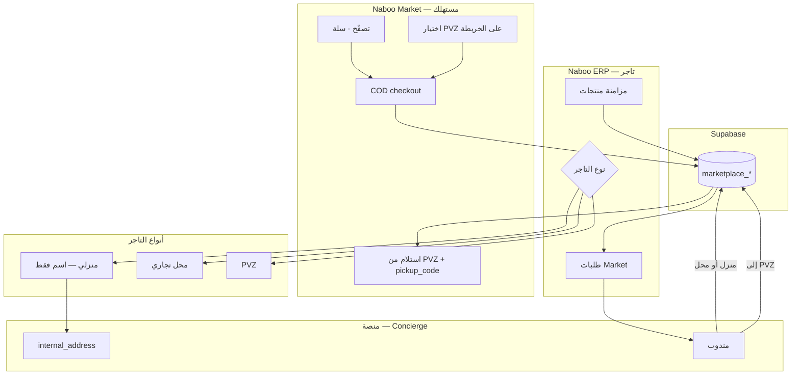

# مراجعة التطبيقين + Ozon + السوق العراقي
## Naboo ERP + Naboo Market — التوصية النهائية v1.0

> **التاريخ:** 2026-06-20  
> **المراجع:**  
> - [`naboo_market_complete_reference_v1.md`](./naboo_market_complete_reference_v1.md)  
> - [`naboo_ozon_github_research_v1.md`](./naboo_ozon_github_research_v1.md)  
> - [`naboo_pilot_90_days_v1.md`](./naboo_pilot_90_days_v1.md)  

---

## فهرس المحتويات

1. [الحكم في جملة واحدة](#1-الحكم-في-جملة-واحدة)
2. [ما بُني فعلاً — مراجعة صادقة](#2-ما-بُني-فعلاً--مراجعة-صادقة)
3. [ثلاثة أنواع تجار (جوهر نموذجك)](#3-ثلاثة-أنواع-تجار-جوهر-نموذجك)
4. [تدفق الطلب — من البائع للمشتري](#4-تدفق-الطلب--من-البائع-للمشتري)
5. [ماذا نأخذ من Ozon — وماذا لا](#5-ماذا-نأخذ-من-ozon--وماذا-لا)
6. [أفضل شيء للسوق العراقي (Pilot)](#6-أفضل-شيء-للسوق-العراقي-pilot)
7. [واجهة المستخدم — التاجر vs المستهلك](#7-واجهة-المستخدم--التاجر-vs-المستهلك)
8. [الكود الخلفي — المعمارية الموصى بها](#8-الكود-الخلفي--المعمارية-الموصى-بها)
9. [الفجوات الحرجة (يجب إغلاقها)](#9-الفجوات-الحرجة-يجب-إغلاقها)
10. [خطة تنفيذ 6 أسابيع](#10-خطة-تنفيذ-6-أسابيع)
11. [قرارات مُقفلة](#11-قرارات-مقفلة)

---

# 1. الحكم في جملة واحدة

> **أنت على المسار الصحيح:** تطبيقان + Supabase واحد + PVZ + COD + خصوصية عنوان البائع.  
> **لا تبحث عن «كود Ozon جاهز»** — خذ **أفكار** Ozon (طلبات · PVZ · كتالوج) وطبّقها **ببساطة Pilot** على العراق.  
> **الأولوية الآن:** إكمال **تدفق البائع من المنزل → أقرب PVZ → المشتري** في البيانات والعمليات — وليس microservices.

---

# 2. ما بُني فعلاً — مراجعة صادقة

## 2.1 Naboo Market (المستهلك) — `naboo_market`

| المكوّن | الحالة | ملاحظة |
|---------|--------|--------|
| Theme كحلي + ذهب (WB-style) | ✅ جيد | dark · `MarketProductCard` · bottom nav |
| Onboarding حي + PVZ | ✅ | قائمة + خريطة `PvzMapScreen` |
| الرئيسية · تصنيفات · بحث | ✅ | شبكة منتجات · أقسام |
| صفحة متجر `StoreScreen` | ✅ | **اسم فقط** من `marketplace_stores_public` |
| PDP · سلة · checkout COD | ✅ | إدراج مباشر Supabase |
| طلباتي + timeline | ✅ | حالات بالعربي |
| Auth + `marketplace_customers` | ✅ | مطلوب قبل الطلب |

**نقاط قوة:** يطابق Ozon/WB في **الشكل** (PVZ أعلى · بطاقات كثيفة · COD).  
**نقاط ضعف:** checkout من العميل مباشرة (بدون Edge Function) · لا اختيار PVZ تلقائي حسب البائع · PDP/Sلة تحتاج نفس polish الـ home.

## 2.2 Naboo ERP (التاجر) — `basra_store_manager`

| المكوّن | الحالة | ملاحظة |
|---------|--------|--------|
| `OnlineOrdersScreen` | ✅ قوي | 5 تبويبات · realtime · FCM · قبول/رفض/جاهز |
| `MarketplaceCatalogSyncService` | ✅ | ERP SQLite → `marketplace_products` عبر `global_id` |
| `MarketPickupSettingsScreen` | ✅ | 3 أوضاع: بيع فقط · PVZ فقط · بيع+PVZ · خريطة |
| `MarketplaceOrdersService` | ✅ | ربط متجر · claim · stock decrement |
| admin-web `/market/*` | ✅ | Concierge stores/products/orders |
| SQL `marketplace_*` | ✅ | مع RLS مصحّح |

**نقاط قوة:** ERP **ليس فارغاً** — لديك بالفعل ما خططنا له في MVP.  
**نقاط ضعف:** `location_type = home` **غير مُستخدَم في الكود** · لا شاشة «عنوان داخلي للمندوب» للتاجر · لا تدفق مندوب في التطبيق.

## 2.3 مقارنة سريعة مع «خطة Ozon»

| مجال Ozon Seller API | Naboo اليوم |
|----------------------|-------------|
| Product import/list | ✅ Catalog sync + Concierge |
| Orders FBS lifecycle | ✅ pending → delivered |
| Delivery point/list | ✅ PVZ map (إحداثيات فقط) |
| Finance/commission | ⏳ 0% Pilot |
| Reviews | ❌ V2 |
| Composer BDUI | ⏳ أقسام ثابتة Flutter (كافٍ Pilot) |

---

# 3. ثلاثة أنواع تجار (جوهر نموذجك)

هذا **أهم تمييز** عن Ozon الكلاسيكي — وتطبيقك يدعمه جزئياً في DB:

```
┌─────────────────────────────────────────────────────────────────────────┐
│  النوع 1: محل تجاري + بائع + PVZ                                        │
│  مثال: سوبر ماركت النور                                                 │
│  Market: اسم + منتجات · خريطة PVZ ✅ · pickup_address عام              │
│  ERP: طلبات · مزامنة منتجات · إعداد PVZ على الخريطة                    │
├─────────────────────────────────────────────────────────────────────────┤
│  النوع 2: PVZ فقط (لا يبيع أونلاين)                                     │
│  مثال: بقالة السلام                                                     │
│  Market: نقطة على الخريطة فقط · لا منتجات (أو منتجات محدودة)            │
│  ERP: وضع pickupOnly في MarketPickupSettings                            │
├─────────────────────────────────────────────────────────────────────────┤
│  النوع 3: بائع من المنزل ⭐ (طلبك الصريح)                                │
│  Market: اسم تجاري فقط · منتجات · ❌ لا خريطة · ❌ لا عنوان            │
│  DB: location_type = 'home' · internal_address سري للمندوب فقط         │
│  اللوجستيك: يجهّز → مندوب يستلم من المنزل → يوصّل لأقرب PVZ → مشتري    │
└─────────────────────────────────────────────────────────────────────────┘
```

## قواعد العرض (لا تُكسَر)

| البيانات | يظهر في Market | يظهر للمندوب/Concierge |
|----------|----------------|-------------------------|
| `name` | ✅ | ✅ |
| `neighborhood_label` | ✅ (حي فقط) | ✅ |
| `pickup_address` + lat/lng | ✅ **فقط إذا** `is_pickup_point` | ✅ |
| `internal_address` | ❌ **أبداً** | ✅ |
| `location_type = home` | ❌ لا pin على الخريطة | ✅ |

**الكود الحالي:** `fetchPickupMapPoints()` يفلتر `is_pickup_point` + إحداثيات — **صحيح**.  
**الناقص:** عند إنشاء متجر منزلي في admin/ERP لا يُفرض `is_pickup_point = false` و`location_type = home` تلقائياً.

---

# 4. تدفق الطلب — من البائع للمشتري

## 4.1 Pilot (العشار — مندوب منصة)

```
مشتري (Market)
  │ اختيار PVZ على الخريطة
  │ سلة → COD → pending
  ▼
تاجر (ERP — Online Orders)
  │ إشعار FCM · قبول → accepted
  │ تجهيز → ready_to_ship
  ▼
مندوب (Concierge — يدوي Pilot)
  │ إذا بائع منزل: استلام من internal_address (واتساب/ops)
  │ إذا محل: استلام من المحل
  │ توصيل → pickup_store_id (PVZ)
  ▼
حالة: in_transit → at_pickup_point
  ▼
مشتري: استلام + COD + pickup_code
  ▼
delivered
```

## 4.2 الفرق حسب نوع التاجر

| الخطوة | محل + PVZ | بائع منزل |
|--------|-----------|-----------|
| `seller_store_id` | النور | متجر المنزل |
| `pickup_store_id` | PVZ يختاره المشتري | **نفس** — PVZ قريب |
| عنوان الاستلام للمندوب | المحل أو internal | **internal_address فقط** |
| ما يرى المشتري | اسم «النور» | اسم تجاري فقط |
| الخريطة | PVZ ظاهر | **البائع غير ظاهر** |

## 4.3 درس Ozon المطبّق

من **Seller API** (`posting` lifecycle) و**go-ozon-marketplace** (Saga):

- **Pilot:** حالات enum كافية — لا Kafka  
- **V2:** Edge Function `create_order` يعيد حساب الأسعار + يتحقق من المخزون  
- **V3:** Saga إذا تجاوزت آلاف الطلبات/يوم  

---

# 5. ماذا نأخذ من Ozon — وماذا لا

## ✅ نأخذ (من بحث GitHub + Habr)

| الفكرة | تطبيق Naboo |
|--------|-------------|
| صفحة = أقسام (widgets) | Home: banner · categories · grids |
| PVZ اختيار قبل الشراء | Onboarding + map + checkout |
| اسم البائع بدون عنوان | `marketplace_stores_public` |
| دورة طلب واضحة | 7 حالات enum |
| كتالوج منفصل عن الطلبات | جداول منفصلة + catalog sync |
| إشعار التاجر فوراً | FCM + Realtime |
| COD افتراضي | checkout `payment_method: cod` |
| قائمة مجالات API كـ checklist | [`naboo_ozon_github_research_v1.md`](./naboo_ozon_github_research_v1.md) §4 |

## ❌ لا نأخذ (Pilot العراق)

| الفكرة | السبب |
|--------|-------|
| Composer API / scraping | غير رسمي · anti-bot |
| 8 microservices + Kafka | 3 طلبات/شهر لا تحتاج |
| توصيل منزلي | العراق: PVZ + COD أوثق |
| دفع إلكتروني أولاً | COD 95%+ |
| محفظة إلزامية للتاجر | يقتل Pilot — 0% عمولة 30 يوم |
| عرض كل متجر على الخريطة | **يخالف** خصوصية البائع المنزلي |

---

# 6. أفضل شيء للسوق العراقي (Pilot)

## 6.1 نموذج العمل (مُثبت لبصرة)

| البند | القرار |
|-------|--------|
| الجغرافيا | **حي واحد** — العشار |
| التجار | offline-first + Concierge |
| المستهلك | Market مجاني · COD فقط |
| التوصيل | **مندوب منصة** 30 يوم |
| الربح | 0% عمولة 30 يوم → 0.5–1% |
| النجاح | **3 طلبات مُسلّمة** شهر 1 |

## 6.2 لماذا PVZ وليس توصيل منزل (مثل Amazon)

| العراق Pilot | Ozon روسيا |
|--------------|------------|
| ثقة منخفضة بالدفع أونلاين | بطاقات منتشرة |
| عناوين غير موحّدة | عناوين دقيقة |
| COD = رفض عند الباب | أقل رفض |
| محل الحي = نقطة ثقة | 50k PVZ |

**نابو = Ozon PVZ مكيّف:** كل محل **يمكن** أن يكون PVZ · البائع المنزلي **لا يظهر** · المشتري يستلم من نقطة معروفة.

## 6.3 ميزة تنافسية محلية

```
طلباتي / واتساب commerce  →  لا مخزون · لا ثقة · لا PVZ
نابو                      →  مخزون حقيقي · اسم محل · PVZ · COD · ERP مجاني
```

---

# 7. واجهة المستخدم — التاجر vs المستهلك

## 7.1 Market (مستهلك) — أولويات UI

| الشاشة | الحالة | التحسين التالي |
|--------|--------|----------------|
| الرئيسية | ✅ WB + كحلي/ذهب | صور حقيقية من Storage |
| خريطة PVZ | ✅ | pin ذهبي · مسافة تقريبية |
| بطاقة منتج | ✅ | ربط صور Supabase |
| PDP | ⚠️ | sticky CTA ذهبي · «يباع بواسطة: اسم فقط» |
| السلة | ⚠️ | تجميع حسب البائع · نفس theme |
| Checkout | ✅ | خطوة PVZ مرئية قبل التأكيد |
| طلباتي | ✅ | QR/rمز الاستلام `pickup_code` بارز |

**قاعدة WB/Ozon:** 70% صورة · سعر ذهبي · PVZ دائماً في الأعلى · **لا خريطة للبائع المنزلي**.

## 7.2 ERP (تاجر) — أولويات UI

| الشاشة | الحالة | التحسين التالي |
|--------|--------|----------------|
| طلبات Market | ✅ قوي | badge · صوت إشعار |
| إعداد Market/PVZ | ✅ | **وضع رابع: بائع منزل** (بدون خريطة) |
| مزامنة كتالوج | ✅ | زر يدوي + حالة آخر sync |
| عنوان داخلي | ❌ | حقل سري — «للمندوب فقط» |
| ERP الكامل | موجود | لا تُرهق التاجر أسبوع 1 |

## 7.3 وضع التاجر في ERP (مقترح نهائي)

```dart
enum MerchantMarketMode {
  sellOnly,        // بائع منزل — لا خريطة
  pickupOnly,      // PVZ فقط
  sellAndPickup,   // محل + PVZ
  // sellOnly + location commercial = محل بدون استلام
}
```

| الوضع | is_published | is_pickup_point | خريطة ERP | خريطة Market |
|-------|--------------|-----------------|-----------|--------------|
| بائع منزل | true | false | ❌ | ❌ |
| محل بائع فقط | true | false | ❌ | ❌ |
| PVZ فقط | true | true | ✅ | ✅ |
| محل + PVZ | true | true | ✅ | ✅ |

---

# 8. الكود الخلفي — المعمارية الموصى بها

## 8.1 الطبقات (Pilot — لا تُعقّد)

```
┌──────────────────────────────────────────────────────────────┐
│  Flutter Market          Flutter ERP          admin-web       │
│  Provider + go_router    Provider + SQLite    Next.js API    │
└────────────┬─────────────────┬──────────────────┬────────────┘
             │                 │                  │
             └─────────────────┼──────────────────┘
                               ▼
┌──────────────────────────────────────────────────────────────┐
│  Supabase (مشروع واحد)                                        │
│  Auth · Storage · Realtime · FCM · PostgreSQL                 │
│  marketplace_* · RPC marketplace_claim_store                  │
└──────────────────────────────────────────────────────────────┘
             ▲
             │ Concierge / مندوب (واتساب Pilot)
```

## 8.2 جداول أساسية (موجودة — لا تُعيد اختراع)

| جدول | دور |
|------|-----|
| `marketplace_stores` | تاجر + PVZ + `internal_address` + `location_type` |
| `marketplace_stores_public` | VIEW آمن للمستهلك |
| `marketplace_products` | كتالوج · `price_fils` int |
| `marketplace_orders` | `seller_store_id` ≠ `pickup_store_id` للمنزلي |
| `marketplace_customers` | مشتري |

## 8.3 ما يجب إضافته في Backend (قصير)

| # | التغيير | لماذا |
|---|---------|-------|
| 1 | `location_type` في admin-web + ERP | تمييز منزلي |
| 2 | RLS: `internal_address` لا يُقرأ من anon | أمان |
| 3 | Edge Function `create_market_order` | إعادة حساب سعر · مخزون · عمولة |
| 4 | جدول `marketplace_ops_tasks` (اختياري Pilot) | مهمة مندوب: من → إلى |
| 5 | `delivery_fee_fils` على المتجر | موجود في cart lookup — أضف للـ SQL |

## 8.4 من Ozon go-marketplace — متى

| النمط | Pilot | V2+ |
|-------|-------|-----|
| Transaction في DB واحد | ✅ insert order + items | |
| Outbox events | ❌ | Realtime كافٍ الآن |
| Saga orchestrator | ❌ | Edge Function بسيط |
| CQRS search | ❌ | `ilike` على name |

---

# 9. الفجوات الحرجة (يجب إغلاقها)

مرتبة بالأولوية:

| # | الفجوة | التأثير | الحل |
|---|--------|---------|------|
| 1 | **بائع منزل** غير مُنمذج في UI | قد يظهر خطأ على الخريطة | وضع `sellOnly` + `location_type=home` |
| 2 | **internal_address** بلا شاشة ERP | المندوب لا يعرف أين يستلم | حقل في admin + ERP (صلاحية owner) |
| 3 | checkout **من العميل** مباشرة | أسعار/مخزون قابل للتلاعب | Edge Function |
| 4 | **تحديث حالة** in_transit/at_pickup | المشتري لا يرى التقدم | زر ops أو شاشة مندوب بسيطة |
| 5 | صور منتجات | UI فارغ | Storage + Concierge upload |
| 6 | RLS customers كامل | فشل checkout أحياناً | migration مُختبر |
| 7 | PDP/سلة theme غير موحّد | تجربة مكسورة | نفس `MarketColors` |

---

# 10. خطة تنفيذ 6 أسابيع

## أسبوع 1–2: إغلاق نموذج التاجر الثلاثي

- [ ] admin-web: `location_type` · `internal_address` عند إنشاء متجر
- [ ] ERP: وضع «بائع منزل» — يخفي الخريطة · يُظهر تحذير عنوان داخلي
- [ ] التحقق: بائع منزلي **لا** يظهر في `PvzMapScreen`
- [ ] وثيقة مندوب: من internal → pickup_store_id

## أسبوع 3: تجربة مشتري كاملة

- [ ] صور Storage على البطاقات
- [ ] PDP + سلة بنفس theme الرئيسية
- [ ] `pickup_code` بارز في تفاصيل الطلب
- [ ] اختبار E2E: onboarding → طلب → ERP قبول

## أسبوع 4: Backend آمن

- [ ] Edge Function `create_market_order`
- [ ] ops: تحديث `in_transit` / `at_pickup_point` (admin-web أو ERP role مندوب)

## أسبوع 5–6: Pilot حقيقي

- [ ] 3 تجار (1 منزلي · 1 محل · 1 PVZ)
- [ ] Concierge + مندوب
- [ ] هدف: **3 طلبات مُسلّمة**

---

# 11. قرارات مُقفلة

| # | القرار |
|---|--------|
| 1 | **تطبيقان** — ERP تاجر · Market مستهلك |
| 2 | **Supabase واحد** |
| 3 | **ثلاثة أنواع تجار** — منزلي · محل · PVZ |
| 4 | البائع المنزلي: **اسم فقط** · لا خريطة · internal للمندوب |
| 5 | المشتري: **يختار PVZ** · COD · يرى timeline |
| 6 | UI Market: **WB layout · Naboo colors** |
| 7 | لا Ozon Composer · لا microservices في Pilot |
| 8 | الربح: **عمولة على البيع** — ليس اشتراك ERP |

---

## ملحق — مخطط واحد يربط كل شيء



---

*الإصدار: 1.0 | مراجعة التطبيقين + Ozon + العراق*
