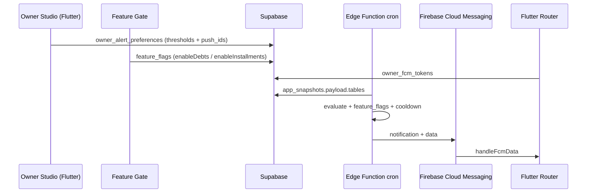

# Owner Alert Push — Backend v1 (S10 follow-up)

> مركز القيادة v3.3 — cron + FCM على الخادم، Flutter يستقبل فقط.

## تدفق البيانات



## SQL — نفّذ بالترتيب

| # | ملف |
|---|-----|
| 1 | `migrations/20260531_owner_alert_push.sql` |
| 2 | `migrations/20260531_owner_push_alert_log.sql` |
| 3 | `migrations/20260532_owner_alert_feature_flags.sql` (إن كان الجدول موجوداً مسبقاً) |
| 4 | `migrations/20260532_owner_alert_push_cron_schedule.sql` (اختياري — pg_cron) |

### جداول

| جدول | الغرض |
|------|--------|
| `owner_alert_preferences` | عتبات + push_alert_ids + **feature_flags** |
| `owner_fcm_tokens` | توكن FCM |
| `owner_push_alert_log` | cooldown 6h / تغيّر العدد |
| `owner_cron_config` | URL + Bearer لـ pg_cron (اختياري) |

## Edge Function

```
supabase/functions/owner-alert-push-cron/
  evaluate_alerts.ts   ← KPI + feature_flags gate
  snapshot_loader.ts   ← app_snapshots
  cooldown.ts
  fcm.ts
```

### feature_flags (مرآة Feature Gate)

```json
{
  "enableDebts": true,
  "enableInstallments": false
}
```

- Flutter يرفعها عبر `OwnerAlertCloudSyncService` + `toServerSyncPayload()`
- يُعاد الرفع تلقائياً عند حفظ `BusinessFeaturesProvider`

## النشر

```bash
supabase secrets set FCM_SERVICE_ACCOUNT_JSON='…'
supabase secrets set CRON_SECRET='…'
supabase functions deploy owner-alert-push-cron --no-verify-jwt
```

### جدولة (اختر واحداً)

**أ) Supabase Dashboard (موصى به)**  
Edge Functions → `owner-alert-push-cron` → **Schedules** → `*/15 * * * *`

**ب) pg_cron**  
عدّل `owner_cron_config` في `20260532_owner_alert_push_cron_schedule.sql` ثم نفّذ الملف.

## Flutter

| مكوّن | الدور |
|--------|--------|
| `OwnerAlertCloudSyncService` | prefs + tokens + resync على Feature Gate |
| `OwnerFcmListenerService` | FCM → Router |
| `OwnerPushActionRegistry` | PDF / واتساب من لوحة المالk |

## الاختبارات

```bash
flutter test test/owner/
deno test supabase/functions/owner-alert-push-cron/evaluate_alerts_test.ts
```

## متبقٍ

- [ ] iOS: رفع APNs Key في Firebase + `aps-environment=production` للإنتاج
- [ ] KPI من جداول Supabase normalised (عند اكتمال sync المنتجات)

## E2E

- سكربتات: `scripts/owner_push_cron_invoke.sh` · `scripts/owner_push_fcm_test_payload.sh`
- checklist: [`owner_push_e2e_checklist.md`](owner_push_e2e_checklist.md)
