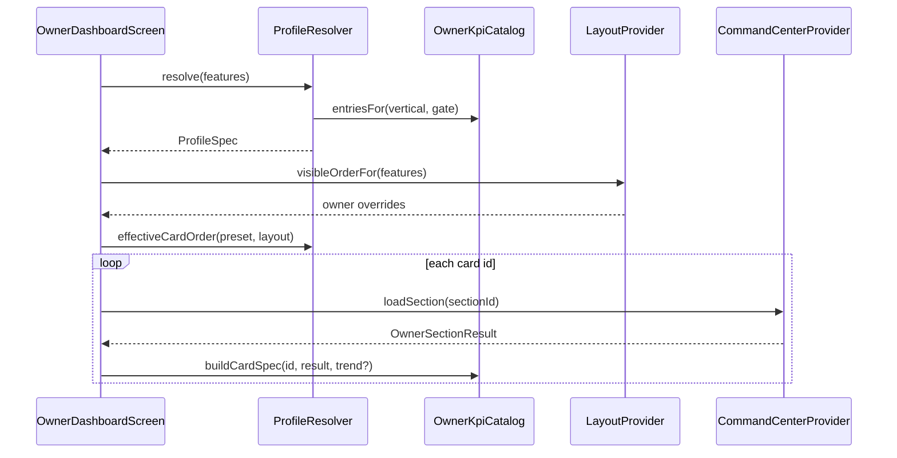

# مركز قيادة صاحب العمل — Spec v3.0 (Vertical Profiles)

**الحالة:** معتمد للتنفيذ — Sprint v3.0 يبدأ بـ `oil_change`  
**المرجع:** `owner_command_center_v1.md` · `owner_command_center_v2.md` · `feature_gate_v1.md` · `home_screen_dynamic_v1.md`  
**القرار المنتج:** v3.0 = **الخيار B** (Presets + Hero + اختصارات من catalog) · عتبات التنبيه → v3.2  
**الإطلاق:** Beta Toggle — لا استبدال فجائي لـ v2

---

## 1. الرؤية

تحويل `OwnerDashboardScreen` من **لوحة أرقام محاسبية عامة** إلى **مركز قيادة تشغيلي (Command Center)** يختلف **جذرياً** حسب `biz.vertical` — بنفس فلسفة `HomeDashboardResolver` للموظف.

| v2 (منفّذ) | v3 (هذا المستند) |
|------------|------------------|
| نفس البطاقات لكل الأنشطة | **Profile** لكل vertical |
| إخفاء/ترتيب فقط | Preset + Hero + catalog اختصارات |
| «1000 د.ع مبيعات» | **1000 د.ع 🔺 +15% عن نفس اليوم الأسبوع الماضي** |
| empty = «0» | **Smart Empty State** + onboarding CTA |
| `OwnerKpiCard` ad-hoc | **عقد KPI موحّد** (`OwnerDashboardCardSpec`) |

---

## 2. طبقات التحكم (Enterprise)

```
┌─────────────────────────────────────────────────────────────┐
│ 0 · Vertical Preset     oil_change | supermarket | …        │
├─────────────────────────────────────────────────────────────┤
│ 1 · Feature Gate        BusinessFeaturesProvider            │
├─────────────────────────────────────────────────────────────┤
│ 2 · Owner Studio (v2)   ترتيب · إخفاء · tenant keys         │
├─────────────────────────────────────────────────────────────┤
│ 3 · Owner Hero (v3)     بطاقة رئيسية + اختصارات catalog     │
└─────────────────────────────────────────────────────────────┘
         │                              │
         ▼                              ▼
 OwnerDashboardProfileResolver    OwnerDashboardLayoutProvider
         │                              │
         └──────────┬───────────────────┘
                    ▼
         OwnerCommandCenterProvider (loaders per section)
```

**قاعدة ملزمة:** `enabledCardIds = catalog.filter(vertical, gate) ∩ layout.visible`.

---

## 3. العقود البرمجية (Interfaces)

> **S1 منفّذ:** الملفات تحت `lib/owner/specs/` + `lib/owner/owner_dashboard_profile_resolver.dart`.

### 3.0 Enterprise cross-cutting (S1)

| Concern | Implementation |
|---------|----------------|
| **RBAC** | `OwnerDashboardAccessContext.permissions` + `requiredPermissionKey` على كل entry · تقاطع: `Vertical ∩ Gate ∩ Layout ∩ permissions` |
| **i18n** | `titleKey` (مثل `owner.kpi.oil_active_cars.title`) — **لا نصوص عربية في Catalog** · `ownerDashboardL10n()` fallback للاختبارات |
| **Tenant** | `OwnerDashboardAccessContext.tenantId` إلزامي · `sectionIdsFor(...)` يُمرَّر للـ loaders في S2 — لا `TenantContextService` داخل Catalog |

**PermissionKeys v3 (جديد):**

- `owner.dashboard.view`
- `owner.kpi.financial` — مبيعات، صندوق، hybrid revenue، avg ticket
- `owner.kpi.operations` — ورديات، سيارات الورshة
- `owner.kpi.debts` — الديون
- `owner.kpi.inventory` — نواقص، قيمة مخzون

**مدخل Resolver:**

```dart
OwnerDashboardResolveInput(features: ..., access: OwnerDashboardAccessContext)
```

`resolveForAccess(input)` — preset بعد فلتر RBAC · `effectiveCardOrder(...)` — layout + RBAC.

### 3.1 `OwnerDashboardProfile`

```dart
/// ملف لوحة المالk — parallel لـ [HomeDashboardProfile].
enum OwnerDashboardProfile {
  oilChangeService,   // oil_change + !pos
  oilChangeHybrid,    // oil_change + pos
  supermarket,
  clothingStore,
  generalRetail,
}
```

### 3.2 `OwnerKpiCatalogEntry` — تعريف بطاقة في الكتalog

```dart
/// بطاقة واحدة في كتalog مركز القيادة — metadata فقط (لا Widget).
class OwnerKpiCatalogEntry {
  const OwnerKpiCatalogEntry({
    required this.id,
    required this.titleAr,
    required this.sectionId,
    required this.verticalAllowList,
    required this.requiredFeatures,
    this.loadPriority = OwnerCardLoadPriority.normal,
    this.supportsTrend = false,
    this.supportsExport = false,
    this.defaultVisible = true,
    this.heroEligible = false,
    this.childSectionIds = const [],
  });

  final String id;                    // مثل 'oil_active_cars'
  final String titleAr;
  final String sectionId;             // يرتبط بـ OwnerSectionIds أو id جديد v3
  final Set<String> verticalAllowList; // BusinessVertical.*
  final List<OwnerFeatureRequirement> requiredFeatures;
  final OwnerCardLoadPriority loadPriority;
  final bool supportsTrend;           // مقارنة WoW / DoD
  final bool supportsExport;          // PDF من البطاقة
  final bool defaultVisible;
  final bool heroEligible;            // يمكن اختيارها Hero
  final List<String> childSectionIds; // sparkline يتبع sales
}

enum OwnerCardLoadPriority {
  critical,  // cash, openShifts — فوري، TTL قصير
  normal,    // sales, debts
  heavy,     // inventoryValue — isolate + TTL طويل
}

enum OwnerFeatureRequirement {
  debts,
  installments,
  pos,
  oilChange,
  loyalty,
  weightSales,
  clothingVariants,
}
```

### 3.3 `OwnerDashboardCardSpec` — عقد العرض (Standardized KPI Contract)

```dart
/// وصفة عرض بطاقة — ما يستهلكه OwnerKpiCard v3.
class OwnerDashboardCardSpec {
  const OwnerDashboardCardSpec({
    required this.catalogId,
    required this.titleAr,
    required this.icon,
    required this.section,
    this.trend,
    this.emptyState,
    this.trailingActions = const [],
    this.onTapRoute,
    this.semanticsLabelBuilder,
  });

  final String catalogId;
  final String titleAr;
  final IconData icon;
  final OwnerSectionResult<dynamic> section;

  /// null = لا مقارنة — البطاقة تعرض القيمة فقط.
  final OwnerKpiTrend? trend;

  /// عند success + data فارغ منطقياً (0 سيارات).
  final OwnerKpiEmptyState? emptyState;

  final List<OwnerKpiCardAction> trailingActions;
  final String? onTapRoute;
  final String Function(dynamic data)? semanticsLabelBuilder;
}

class OwnerKpiTrend {
  const OwnerKpiTrend({
    required this.deltaPercent,       // 15.0 = +15%
    required this.direction,          // up | down | flat
    required this.comparisonLabelAr,  // «عن نفس اليوم الأسبوع الماضي»
  });

  final double deltaPercent;
  final OwnerTrendDirection direction;
  final String comparisonLabelAr;
}

class OwnerKpiEmptyState {
  const OwnerKpiEmptyState({
    required this.messageAr,
    required this.ctaLabelAr,
    required this.ctaRouteId,
  });

  final String messageAr;
  final String ctaLabelAr;
  final String ctaRouteId;
}

class OwnerKpiCardAction {
  const OwnerKpiCardAction({
    required this.tooltipAr,
    required this.icon,
    required this.onInvoke, // export PDF | whatsapp | navigate
  });
}
```

**التزامات العقد (إلزامي لكل بطاقة v3):**

| حالة | سلوك UI |
|------|---------|
| `loading` + لا data | Skeleton shimmer (ليس CircularProgress فقط) |
| `error` + لا data | رسالة عربية + **إعادة المحاولة** → `refreshSection` |
| `error` + stale data | عرض stale + شارة + retry |
| `success` + empty logic | `OwnerKpiEmptyState` + CTA |
| `stale` | `OwnerStaleBadge` |
| `supportsTrend` | سطر ثانٍ تحت القيمة: 🔺/🔻 + نسبة + label |
| `supportsExport` | أيقونة PDF في trailing |

### 3.4 `OwnerDashboardProfileSpec` — مخرج Resolver

```dart
/// وصفة لوحة المالk الكاملة لنشاط واحد — parallel لـ [HomeDashboardSpec].
class OwnerDashboardProfileSpec {
  const OwnerDashboardProfileSpec({
    required this.profile,
    required this.defaultCardOrder,
    required this.defaultHeroCatalogId,
    required this.defaultShortcutIds,
    required this.activityFeedFilter,
    required this.morningBriefBuilderId,
    this.hybridRevenueSplit = false,
  });

  final OwnerDashboardProfile profile;

  /// ترتيب افتراضي قبل Owner Studio overrides.
  final List<String> defaultCardOrder;      // catalog ids

  /// بطاقة Hero في شريط «ملخص الصباح».
  final String defaultHeroCatalogId;

  /// حتى 6 اختصارات من catalog.
  final List<String> defaultShortcutIds;

  /// أي أنواع RecentActivityKind تُعرض.
  final Set<RecentActivityKind> activityFeedFilter;

  /// معرّف builder لسطر الملخص العلوي.
  final String morningBriefBuilderId;

  /// oilChangeHybrid: إيراد مقسّم (خدمة vs POS).
  final bool hybridRevenueSplit;
}
```

### 3.5 `OwnerDashboardProfileResolver`

```dart
/// يبني [OwnerDashboardProfileSpec] من vertical + feature gate.
abstract final class OwnerDashboardProfileResolver {
  static OwnerDashboardProfileSpec resolve(BusinessSetupSettingsData features);

  /// profile enum من features — للاختبارات.
  static OwnerDashboardProfile detectProfile(BusinessSetupSettingsData f);

  /// دمج: preset order ∩ catalog allowed ∩ layout visible.
  static List<String> effectiveCardOrder({
    required OwnerDashboardProfileSpec preset,
    required OwnerDashboardLayoutProvider layout,
    required BusinessSetupSettingsData features,
  });
}
```

**تدفق البيانات:**



### 3.6 `OwnerKpiCatalog`

```dart
/// مصدر الحقيقة لكل البطاقات الممكنة — v3 يوسّع OwnerSectionIds.
abstract final class OwnerKpiCatalog {
  static List<OwnerKpiCatalogEntry> allEntries;

  static List<OwnerKpiCatalogEntry> entriesFor({
    required String vertical,
    required BusinessSetupSettingsData features,
  });

  static OwnerKpiCatalogEntry? byId(String catalogId);

  /// يبني OwnerDashboardCardSpec للعرض — trend/empty من repositories.
  static OwnerDashboardCardSpec buildCardSpec({
    required String catalogId,
    required OwnerCommandCenterSnapshot snapshot,
    required OwnerDateRange range,
    required Map<String, OwnerKpiTrend?> trends,
  });
}
```

### 3.7 توسيع `OwnerSectionIds` (v3 — oil_change أولاً)

```dart
abstract class OwnerSectionIds {
  // ── v1 (موجود) ──
  static const staffUsers = 'staffUsers';
  static const sales = 'sales';
  // …

  // ── v3 oil_change ──
  static const oilActiveCars = 'oilActiveCars';
  static const oilChangesCount = 'oilChangesCount';
  static const oilStockShortages = 'oilStockShortages'; // فلتر volumeLiter
  static const oilAvgTicket = 'oilAvgTicket';
  static const hybridRevenueSplit = 'hybridRevenueSplit'; // donut service vs POS
}
```

**TTL مقترح (إضافة لـ `OwnerSectionTtl`):**

| sectionId | TTL | priority |
|-----------|-----|----------|
| `oilActiveCars` | 30s | critical |
| `oilChangesCount` | 2m | normal |
| `oilStockShortages` | 3m | normal |
| `oilAvgTicket` | 5m | normal |
| `hybridRevenueSplit` | 2m | normal |
| `inventoryValue` | 10m | heavy (compute) |

---

## 4. جلب البيانات والأداء (Enterprise)

### 4.1 Lazy per-card loading (موجود جزئياً — v3 يُ_formalize)

- `OwnerCommandCenterProvider.refreshAll`: `Future.wait` + `eagerError: false` ✅
- v3: **ترتيب التحميل** حسب `OwnerCardLoadPriority`:
  1. `critical` — parallel فوري
  2. `normal` — parallel بعد 1 frame
  3. `heavy` — `compute()` / isolate؛ Skeleton حتى ينتهي

### 4.2 Skeleton loaders

- كل `OwnerDashboardCardSpec` في `loading` → `OwnerKpiCardSkeleton` (shimmer)
- Hero strip skeleton منفصل

### 4.3 Trend queries (Actionable Insights)

```dart
class OwnerTrendRepository {
  /// مقارنة مبيعات/غيارات: نفس نطاق التاريخ vs الفترة المرجعية.
  Future<OwnerKpiTrend?> compareSalesWoW({
    required int tenantId,
    required OwnerDateRange range,
    String? staffFilter,
  });

  Future<OwnerKpiTrend?> compareOilChangesWoW({ ... });
}
```

**قواعد العرض:**

| delta | أيقونة | لون |
|-------|--------|-----|
| > +5% | 🔺 | primary |
| < -5% | 🔻 | error |
| else | — | onSurfaceVariant |

**نص:** «مرتفعة 15% عن نفس اليوم الأسبوع الماضي» — `intl` + `ar_SA`.

### 4.4 Offline / stale

- بدون تغيير v1: `OwnerSectionResult.stale` + banner
- Trend: إن فشل المقارنة → إخفاء سطر Trend (لا تسقط البطاقة)

---

## 5. Beta Toggle — Feature Flag

**مفتاح:** `app_settings` → `owner.command_center.v3_beta` (bool, per tenant)

| القيمة | السلوك |
|--------|--------|
| `false` (default) | v2 layout + بطاقات v1 |
| `true` | v3 ProfileResolver + Hero + catalog shortcuts |

**UI:** إعدادات المتجر → «تجربة مركز القيادة v3» + وصف قصير.

**Regression:** `phase3_owner_dashboard_mvp_regression_test.dart` + `test/owner/owner_dashboard_profile_*`.

---

## 6. ورشة غيار الزيت — أول تطبيق (v3.0)

### 6.1 Profiles

| Profile | شروط | ملاحظة |
|---------|--------|--------|
| `oilChangeService` | `vertical == oil_change` && `!enablePos` | الافتراضي في feature_gate |
| `oilChangeHybrid` | `vertical == oil_change` && `enablePos` | دمج إيراد + مخزون |

### 6.2 كتalog بطاقات — `oilChangeService`

| catalogId | sectionId | titleAr | hero | trend | export | default order |
|-----------|-----------|---------|------|-------|--------|---------------|
| `oil_active_cars` | `oilActiveCars` | سيارات في الورشة | ✅ | ❌ | ❌ | 1 |
| `oil_changes_period` | `oilChangesCount` | غيارات الفترة | ✅ | ✅ | ❌ | 2 |
| `oil_stock_shortages` | `oilStockShortages` | نواقص زيوت وفلاتر | ❌ | ❌ | ✅ PDF | 3 |
| `debts_summary` | `debts` | إجمالي الديون | ❌ | ❌ | ❌ | 4 |
| `open_shifts` | `openShifts` | الورديات النشطة | ❌ | ❌ | ❌ | 5 |
| `cash_summary` | `cash` | الصندوق | ❌ | ❌ | ❌ | 6 |
| `oil_avg_ticket` | `oilAvgTicket` | متوسط قيمة الغيار | ❌ | ✅ | ❌ | 7 |
| `inventory_value` | `inventoryValue` | قيمة المخzون | ❌ | ❌ | ❌ | 8 (heavy) |

**مخفى افتراضياً:** `sales` generic (يُستبدل بـ `oil_changes_period`)، `installments`، `salesSparkline` generic → sparkline م tied لـ `oil_changes_period`.

### 6.3 كتalog — `oilChangeHybrid` (Merge)

**إضافة/استبدال:**

| catalogId | sectionId | titleAr | ملاحظة |
|-----------|-----------|---------|--------|
| `hybrid_revenue_split` | `hybridRevenueSplit` | إجمالي الإيرادات | donut: % غيار vs % POS |
| `oil_stock_shortages` | `oilStockShortages` | نواقص المخzون | زيوت + فلاتر + **قطع POS** |
| `parked_sales_alert` | *(v3.1)* | مبيعات معلقة | إن `enablePos` |

**`hybridRevenueSplit` data model:**

```dart
class HybridRevenueKpi {
  final int serviceFils;      // فواتير/بطاقات oil_change
  final int posRetailFils;    // invoices POS
  int get totalFils => serviceFils + posRetailFils;
  double get serviceShare => serviceFils / totalFils;
}
```

### 6.4 Hero + Morning Brief

**Default Hero:** `oil_active_cars` (service) · `hybrid_revenue_split` (hybrid)

**Morning Brief (سطر واحد تحت Hero):**

```
«12 غياراً · 3 سيارات بالانتظار · 2 نواقص حرجة»
```

Builder: `OilChangeMorningBriefBuilder` — يقرأ snapshot sections.

### 6.5 Smart Empty States — oil_change

| بطاقة | empty message | CTA |
|-------|---------------|-----|
| `oil_active_cars` | «لا توجد سيارات في الورشة الآن» | «غيار زيت جديد» → `oil_change_create` |
| `oil_changes_period` | «لم تُسجَّل غيارات في هذه الفترة» | «أول غيار» → `oil_change_create` |
| `oil_stock_shortages` | «المخzون جيد — لا نواقص» | «المخzون» → inventory |
| `debts_summary` | «لا مديونية على العملاء» | — |

### 6.6 اختصارات catalog (Default — حتى 6)

| id | label | route |
|----|-------|-------|
| `sc_oil_report` | تقرير الغيارات | reports (oil panel) |
| `sc_purchase_pdf` | PDF طلبية | inline PDF |
| `sc_oil_log` | سجل الغيارات | oil_services_log |
| `sc_customers` | العملاء | customers |
| `sc_inventory` | المخzون | inventory |
| `sc_cash` | الصندوق | cash |

**Owner Studio B:** المالk يستبدل حتى 3 اختصارات من catalog المسموح.

### 6.7 Activity Feed Filter — oil_change

```dart
activityFeedFilter: {
  RecentActivityKind.workShift,
  RecentActivityKind.invoice,      // غيار يولّد فاتورة
  RecentActivityKind.productCreated, // سعر/صنف زيت
  RecentActivityKind.stockVoucher,
  // exclude: loyalty (if off), parked (if !pos)
}
```

### 6.8 Repositories (مصادر SQL)

| sectionId | Repository | ملاحظة |
|-----------|------------|--------|
| `oilActiveCars` | `OilChangeReportsRepository` / `service_orders` | status pending/in_progress |
| `oilChangesCount` | `OwnerCommandCenterRepository` + filter oil invoices | أو `oil_change_reports` |
| `oilStockShortages` | `OwnerInventoryRepository` + `stockBaseKind=volumeLiter` | |
| `oilAvgTicket` | aggregate fils / count | `compute()` إن > 16ms |
| `hybridRevenueSplit` | split query invoices by source | |

**tenant_id + deleted_at** في كل استعلام — ERP rules.

---

## 7. Action Rail + Notifications (v3.2 — مو spec v3.0)

> **مؤجل:** يحتاج `OwnerAlertRulesProvider` + ربط `NotificationProvider`.

| تنبيه | مصدر | إجراء |
|-------|------|-------|
| N فلاتر ناقصة | `oilStockShortages` | PDF · (مستقبلي) push |
| M عملاء متأخرين | debts aging | واتsapp batch |

v3.0 يعرض **placeholder** في spec فقط — لا UI في Sprint الأول.

---

## 8. Owner Studio v3.0 (الخيار B)

**ورقة «استوديو اللوحة» — توسيع v2 sheet:**

| إعداد | v2 | v3.0 |
|-------|-----|------|
| ترتيب / إخفاء | ✅ | ✅ |
| **Hero** | ❌ | dropdown من `heroEligible` catalog |
| **اختصارات** | ❌ | multi-select max 6 من shortcut catalog |
| عتبات تنبيه | ❌ | v3.2 |

**مفاتيح التفضيلات (per tenant — `app_settings` عبر `AppSettingsRepository`):**

```
owner.command_center.v3_beta
owner.dashboard.hero_v3
owner.dashboard.shortcuts_v3
owner.dashboard.card_order_v3
owner.dashboard.card_visible_v3
owner.dashboard.card_order_v2      // v2 layout
owner.dashboard.card_visible_v2
```

> **S5 ✅:** ترحيل تلقائي من SharedPreferences القديمة عند أول قراءة. قوائم Hero/اختصارات تُبنى من `OwnerKpiCatalog` بعد RBAC + Feature Gate. `OwnerDashboardStudioResolver` يعيد fallback للـ Vertical Preset. زر «استعادة الافتراضيات» في ورقة الاستوديو.

---

## 9. Dark Mode & Accessibility

- استخدام `Theme.of(context).colorScheme` — لا ألوان hardcoded جديدة في v3 cards
- Trend 🔺/🔻: لا يعتمد على اللون فقط — نص `comparisonLabelAr` إلزامي
- كل بطاقة: `Semantics` label = title + value + trend (موجود v1 — v3 يوسّع)
- Command Center backgrounds: `GlassBackground` + contrast كافٍ في dark (مراجعة alpha)

---

## 10. هيكل الملفات (v3.0 Sprint)

```
lib/owner/
  specs/
    owner_kpi_catalog.dart              ← NEW
    owner_dashboard_profile_spec.dart   ← NEW
    owner_command_center_spec.dart      ← ي delegating إلى catalog
  owner_dashboard_profile_resolver.dart ← NEW
  models/
    owner_dashboard_card_spec.dart      ← NEW
    owner_kpi_trend.dart                ← NEW
    owner_hybrid_revenue_kpi.dart       ← NEW
  repositories/
    owner_oil_dashboard_repository.dart ← NEW
  widgets/
    owner_kpi_card_v3.dart              ← NEW (or extend OwnerKpiCard)
    owner_kpi_card_skeleton.dart        ← NEW
    owner_morning_brief_strip.dart      ← NEW
    owner_shortcuts_bar.dart            ← NEW
    owner_dashboard_studio_sheet.dart   ← extends layout sheet
  providers/
    owner_dashboard_layout_provider.dart ← hero + shortcuts keys
    owner_command_center_provider.dart   ← loaders for new section ids

lib/screens/owner/
  owner_dashboard_screen.dart           ← branch: v2 | v3 via beta flag

test/owner/
  owner_kpi_catalog_test.dart
  owner_dashboard_profile_resolver_test.dart
  owner_oil_dashboard_repository_test.dart
```

---

## 11. مراحل التنفيذ

| Sprint | محتوى | Definition of Done |
|--------|--------|-------------------|
| **S1** | Catalog + ProfileSpec + Resolver (oil only) + tests | resolve(oilChange) → 8 cards |
| **S2** | Repositories: oilActiveCars, oilChangesCount, oilStockShortages | unit + tenant_id |
| **S3** | UI: Hero + Morning Brief + card v3 + skeleton | widget tests |
| **S4** | Trends WoW for oil_changes + avg ticket | trend line visible |
| **S5** | Studio B: hero + shortcuts prefs (app_settings + filtered catalog + fallbacks) | ✅ unit tests |
| **S6** | Beta toggle + hybrid profile + revenue split + regression | ✅ 86 owner tests |
| **S7** | supermarket profile (copy pattern) | ✅ unit tests |

**خارج v3.0:** Action Rail · alert rules · push · supermarket/clothing presets.

---

## 12. معايير القبول — v3.0 oil_change

- [ ] Beta off → v2 unchanged (no regression) — **S6 regression tests**
- [ ] Beta on + `oil_change` → Hero «سيارات في الورشة» أو hybrid revenue
- [ ] Hybrid: donut/service+POS percentages sum 100% — **OwnerHybridRevenueKpiCard**
- [ ] POS enable → hybrid profile without losing saved card order — **mergeCatalogOrderWithPreset**
- [ ] Morning Brief يتحدث مع refresh
- [ ] بطاقة غيارات تعرض trend WoW عند توفر بيانات مرجعية
- [ ] empty state «أول غيار» يفتح `oil_change_create`
- [ ] Layout Studio: hero + shortcuts persist per tenant
- [ ] Activity feed لا يعرض loyalty/parked عند gate off
- [ ] كل loader: `tenant_id` + `deleted_at IS NULL`
- [ ] heavy cards في `compute()` — frame budget < 16ms paint
- [ ] 15+ unit tests جديدة في `test/owner/`

---

## 13. علاقة بالوثائق

| وثيقة | علاقة |
|--------|--------|
| `owner_command_center_v1.md` | Provider + partial failure + audit |
| `owner_command_center_v2.md` | Studio ترتيب/إخفاء + custom date |
| `feature_gate_v1.md` | requiredFeatures |
| `home_screen_dynamic_v1.md` | parallel resolver pattern |
| `owner_role_dashboard_master_plan.md` | owner route + MVP |

---

## 14. سجل الإصدارات

| إصدار | ملاحظة |
|-------|--------|
| v3.0-draft | spec أولي — oil_change + Option B + contracts |
| v3.0-s1 | ✅ Catalog + Resolver + tests + RBAC/i18n/tenant contracts |
| v3.0 | تنفيذ Sprint S2–S6 (UI + repositories) |
| v3.2 | Action Rail + alert thresholds + notifications |

---

**الخطوة التالية للتنفيذ:** Sprint **S1** — `OwnerKpiCatalog` + `OwnerDashboardProfileResolver` + tests بدون UI.
